# Procesamiento de SVG a RML con Mods

Este apartado constituye una continuación directa de nuestra documentación de diseño en KiCad. Una vez que hemos exportado los archivos necesarios de nuestras placas, el siguiente paso crítico en el proceso de fabricación digital con la fresadora Roland MonoFab (SRM-20) es transformar nuestros vectores en trayectorias de maquinado legibles (archivos `.rml`) utilizando la herramienta web **Mods**.

---

## Tabla de Contenidos
1. [Verificación y Preparación previa en Inkscape](#1-verificación-y-preparación-previa-en-inkscape)
   - [1.1. Descarga y Sitio Oficial](#11-descarga-y-sitio-oficial)
   - [1.2. Consideraciones Clave de Diseño Vectorial](#12-consideraciones-clave-de-diseño-vectorial)
2. [Introducción a la Plataforma Mods](#2-introducción-a-la-plataforma-mods)
   - [2.1. Acceso y Selección del Programa](#21-acceso-y-seleccion-del-programa)
   - [2.2. Vista General de la Interfaz de Nodos](#22-vista-general-de-la-interfaz-de-nodos)
3. [Recorrido Detallado por la Interfaz de Mods](#3-recorrido-detallado-por-la-interfaz-de-mods)
   - [3.1. Esquina Superior Izquierda: Carga del Archivo SVG](#31-esquina-superior-izquierda-carga-del-archivo-svg)
   - [3.2. Panel de Vistas (Lado Derecho): Previsualización Gráfica e Inversión](#32-panel-de-vistas-lado-derecho-previsualización-gráfica-e-inversión)
   - [3.3. Esquina Inferior Izquierda: Unidades y Herramientas Predefinidas](#33-esquina-inferior-izquierda-unidades-y-herramientas-predefinidas)
   - [3.4. Parte Central: Configuración Avanzada de Herramienta y Cálculo 3D](#34-parte-central-configuración-avanzada-de-herramienta-y-cálculo-3d)
   - [3.5. Panel Derecho: Orígenes, Velocidades y Exportación RML](#35-panel-derecho-orígenes-velocidades-y-exportación-rml)
4. [Procedimiento de Fabricación y Configuración por Etapas](#4-procedimiento-de-fabricación-y-configuración-por-etapas)
   - [4.1. Primera Etapa: Contornos](#41-primera-etapa-contornos)
   - [4.2. Segunda Etapa: Pistas (Trazado)](#42-segunda-etapa-pistas-trazado)
   - [4.3. Tercera Etapa: Perforaciones](#43-tercera-etapa-perforaciones)
5. [Resumen de Parámetros Clave para el Maquinado](#5-resumen-de-parámetros-clave-para-el-maquinado)

---

## 1. Verificación y Preparación previa en Inkscape

Antes de enviar cualquier diseño a la plataforma de maquinado, es fundamental asegurarnos de que los archivos vectoriales (específicamente el contorno de nuestra placa) cumplan con las condiciones geométricas adecuadas para evitar fallos físicos en el material.

### 1.1. Descarga y Sitio Oficial
Si detectas que el contorno de tu placa parece cortado o mal delimitado, se recomienda utilizar un editor de vectores. Para este propósito utilizamos **Inkscape**. Puedes acceder a su plataforma y obtener los instaladores desde su [sitio oficial de Inkscape](https://inkscape.org/){: target="_blank" }. No profundizaremos demasiado en el uso general del software, pero sí en una regla de oro para la manufactura.

### 1.2. Consideraciones Clave de Diseño Vectorial
* **Todo dentro del lienzo:** Es indispensable verificar que todos los vectores de corte y trazo se encuentren completamente dentro del área del lienzo de trabajo en Inkscape. De lo contrario, la herramienta de exportación podría omitir secciones o generar errores de geometría.
* **Manejo de tolerancias:** Es vital respetar márgenes y tolerancias adecuados en las pistas y contornos de la placa. Si los vectores están mal posicionados o demasiado justos, el cabezal de corte podría invadir zonas críticas y seccionar una pista por error.

| Vector Incorrecto (Cortado / Fuera de límites) | Vector Correcto (Alineado y dentro del lienzo) |
| :---: | :---: |
| 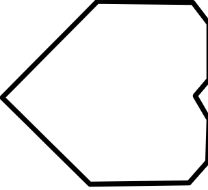 Figura 1.1: Ejemplo de vector cortado o mal posicionado fuera del área de trabajo. | 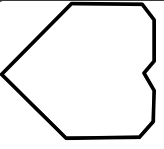 Figura 1.2: Ejemplo de vector correctamente alineado y dentro del lienzo. |

---

## 2. Introducción a la Plataforma Mods

Una vez que nuestros archivos vectoriales (SVG) están limpios y correctamente acotados, pasamos a **Mods**, una herramienta web basada en nodos ampliamente utilizada en entornos Fab Lab para la manufactura digital.

### 2.1. Acceso y Selección del Programa
1. Ingresa al sitio oficial de la herramienta a través de su entorno web en [Mods Community](https://mods.cba.mit.edu/){: target="_blank" }.
2. Dirígete a la pestaña de **Programs** y dentro del buscador escribe **`srm-20mil`**.
3. Selecciona la opción correspondiente a **`mill 2d pcb`** para desplegar el diagrama de nodos diseñado específicamente para el fresado de circuitos impresos en la SRM-20.

  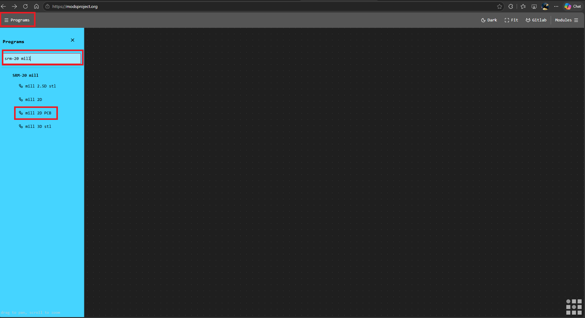 
  Figura 2.1: Búsqueda y selección del programa srm-20mil mill 2d pcb en la plataforma Mods.

### 2.2. Vista General de la Interfaz de Nodos
Al cargar el programa, verás un conjunto interconectado de bloques o nodos que procesan la información de manera secuencial (desde la entrada del archivo hasta la generación del código de la máquina). A continuación, se presenta una vista general destacando con distintos colores las secciones clave en las que debemos enfocar nuestra atención durante el flujo de trabajo:

* 🔵 **Azul:** Módulo de entrada de archivos y visualización gráfica.
* 🟢 **Verde:** Configuración de unidades y selección de herramientas de corte.
* 🟠 **Naranja:** Parámetros de la herramienta, diámetros, número de pasadas y cálculo de trayectorias.
* 🟣 **Morado:** Control de origen, velocidades de avance y guardado final del archivo RML.

  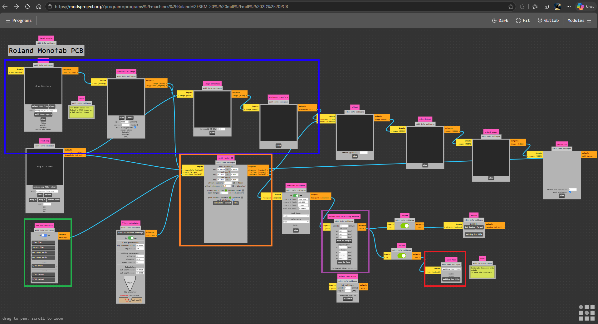 
  Figura 2.2: Mapa general de la interfaz de nodos de Mods organizada por secciones operativas.

---

## 3. Recorrido Detallado por la Interfaz de Mods

Una vez que comprendemos la estructura general de los nodos, procederemos a desplazarnos paso a paso por cada una de las secciones operativas de la interfaz para configurar correctamente el maquinado de nuestra placa.

### 3.1. Esquina Superior Izquierda: Carga del Archivo SVG
En esta sección inicial se gestiona la entrada de nuestro diseño. 
* Encontraremos el módulo para cargar el archivo vectorial (SVG) que exportamos previamente (ya sea contorno, pistas o perforaciones).
* Es importante verificar que el archivo cargue correctamente antes de continuar con la visualización.

  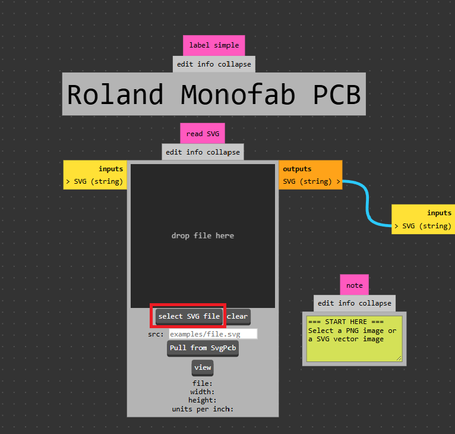 
  Figura 3.1: Módulo de entrada de archivos vectoriales situado en la esquina superior izquierda.

### 3.2. Panel de Vistas (Lado Derecho): Previsualización Gráfica e Inversión
Justo al lado derecho del módulo de entrada, se despliegan distintas vistas e interpretaciones gráficas de nuestro archivo cargado. 
* **Regla fundamental:** Lo que se visualiza en color **negro** representa las zonas donde la fresa pasará removiendo material, mientras que las zonas blancas permanecerán intactas.
* Aquí es importante mencionar que, en caso de que esté invertida la sección de corte de nuestras pistas o cualquier otro proceso, podemos arreglarlo dando clic en la opción **"invert"**.
* Aquí podemos validar visualmente que las pistas o los contornos se rendericen de manera correcta y sin recortes extraños.

  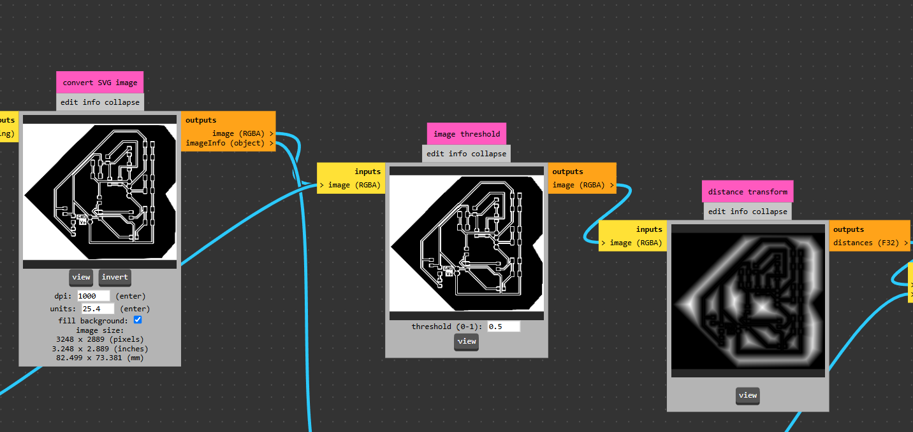 
  Figura 3.2: Panel lateral derecho de visualización gráfica del archivo cargado.

  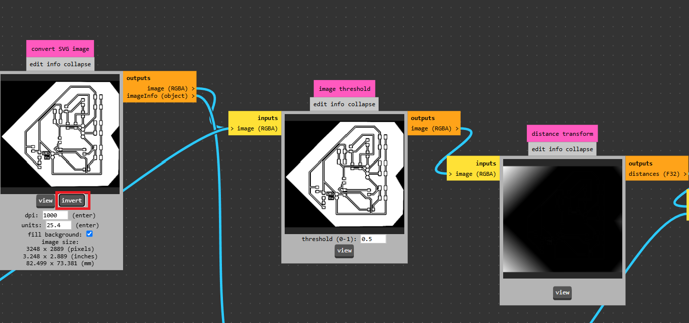 
  Figura 3.3: Vista previa del diseño con la función de inversión aplicada correctamente.

### 3.3. Esquina Inferior Izquierda: Unidades y Herramientas Predefinidas
Desplazándonos hacia la esquina inferior izquierda, configuraremos las bases métricas y operativas del trabajo:
* **Conversión de unidades:** Asegúrate de cambiar las medidas de pulgadas (`in`) a milímetros (`mm`) para trabajar bajo el sistema métrico estándar.
* **Herramientas predefinidas:** En este apartado podemos seleccionar algunas configuraciones y geometrías de corte ya preestablecidas, dependiendo de si realizaremos un proceso de contorno, trazado de pistas o perforación.

  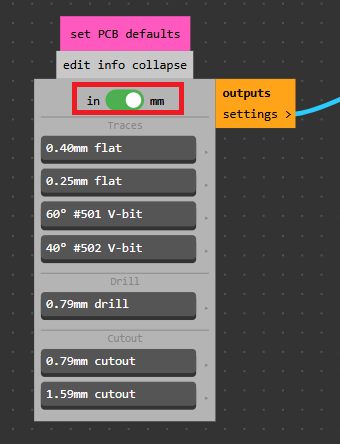 
  Figura 3.4: Selector de unidades métricas y herramientas predefinidas.

### 3.4. Parte Central: Configuración Avanzada de Herramienta y Cálculo 3D
En la zona central de los nodos encontraremos los parámetros finos de la herramienta de corte:
* **Modificación de parámetros:** Aquí podemos ajustar de forma precisa el diámetro de la herramienta y el número de pasadas que realizará la máquina.
* **Simulación visual:** El sistema nos ofrece una estimación gráfica de cómo se comportará la herramienta sobre la superficie de la placa.
* **Cálculo de trayectorias:** Al presionar el botón de **Calculate**, la herramienta procesará las trayectorias y se abrirá automáticamente una pestaña adicional donde podremos inspeccionar la **vista interactiva en 3D** del maquinado.

  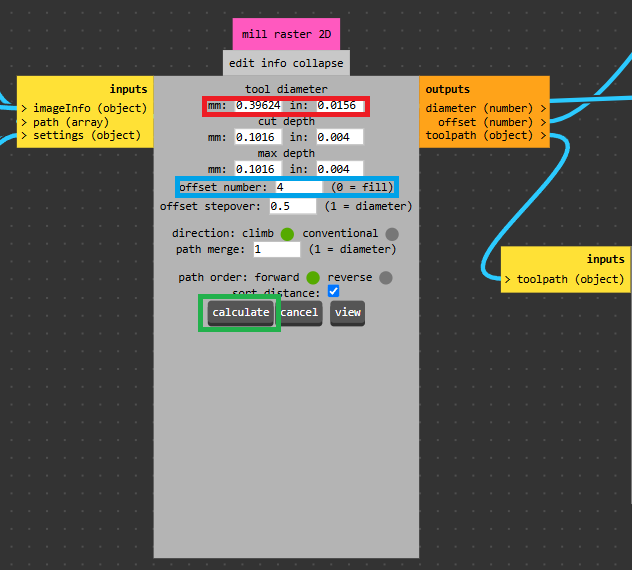 
  Figura 3.5: Bloques centrales de configuración de herramientas y botón de cálculo.

  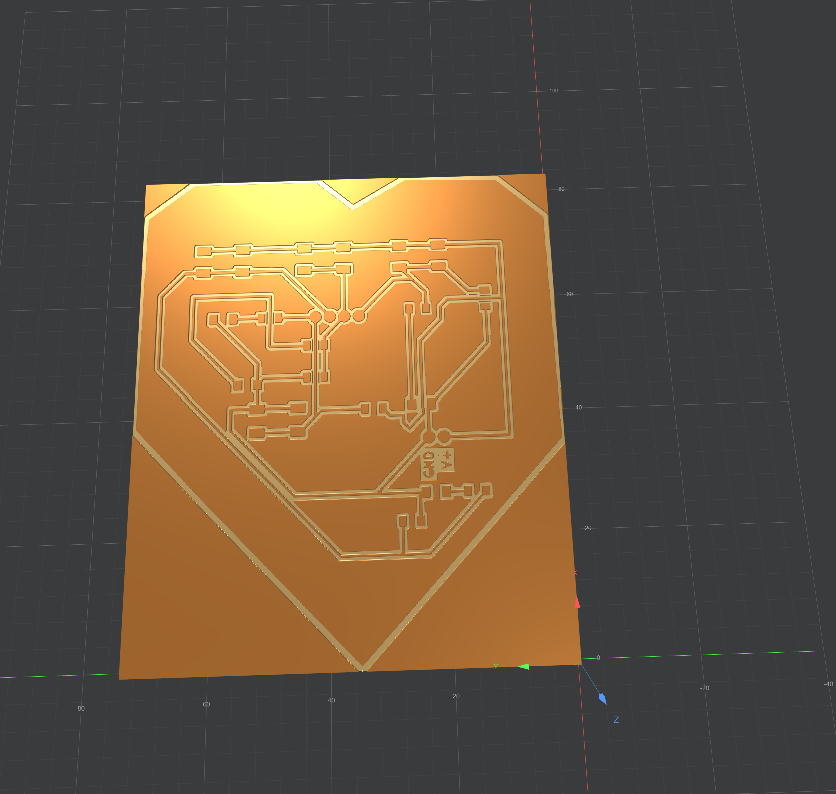 
  Figura 3.6: Ventana de simulación e inspección de la vista 3D interactiva del maquinado.

### 3.5. Panel Derecho: Orígenes, Velocidades y Exportación RML
Finalmente, desplazándonos hacia la sección derecha de los nodos, controlaremos los parámetros finales de posicionamiento y ejecución:
* **Fijar el Origen:** Por defecto, estableceremos siempre **`0` en Y** y **`0` en Z**. El único valor que modificaremos es **X** en escenarios específicos donde estemos fabricando dos placas simultáneamente o requiramos un desfase en la cama de la fresadora.
* **Control de Velocidades:** 
  * Para los procesos de **pistas y contornos**, utilizaremos una velocidad de avance de **4 mm/s**.
  * Para los procesos de **perforaciones**, la velocidad se reduce drásticamente a **0.4 o 0.3 mm/s** para evitar la ruptura de las brocas delgadas.
* **Estimación de Tiempo:** En este mismo panel el sistema calculará un estimado del tiempo que le tomará a la MonoFab completar el proceso actual.
* **Guardado del Archivo:** Por último, encontraremos la opción para generar y guardar el archivo con extensión `.rml` directamente en nuestro equipo, listo para enviarse a la máquina.

  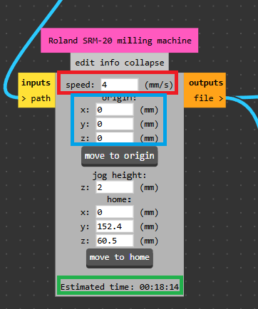 
  Figura 3.7: Configuración de coordenadas de origen y control de velocidades.

  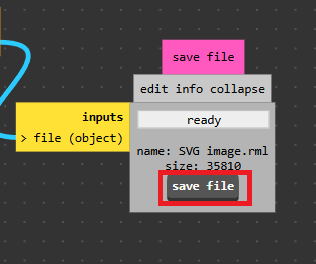 
  Figura 3.8: Módulo final para la generación y guardado del archivo RML en el equipo.

---

## 4. Procedimiento de Fabricación y Configuración por Etapas

Para llevar a cabo la manufactura exitosa de nuestra placa en la Roland MonoFab (SRM-20) utilizando Mods, debemos seguir un orden estricto de procesos. 

⚠️ **Regla fundamental entre procesos:** Es **indispensable** dar un *refresh* (recargar) a la página web de Mods al finalizar cada etapa. Esto nos garantiza limpiar la memoria caché de los nodos y evitar conflictos al cargar un nuevo archivo vectorial (SVG) con configuraciones de herramientas distintas.

### 4.1. Primera Etapa: Contornos
Comenzaremos procesando el archivo vectorial correspondiente al contorno exterior de nuestra placa.
* **Herramienta a utilizar:** Fresas o cortadores de **2 mm**.
* **Configuración en Mods:** 
  * Cargamos el SVG de contornos.
  * Ajustamos el diámetro de la herramienta a **2 mm**.
  * Definimos el número de pasadas necesarias según el grosor del material de la tablilla.
  * Asignamos la velocidad de avance estándar de **4 mm/s**.
  * Verificamos en la vista 3D que el contorno se realice de forma externa o correcta sin invadir el área útil.
  * Guardamos el archivo `.rml` resultante.

* **Visualización de nuestro archivo:**

  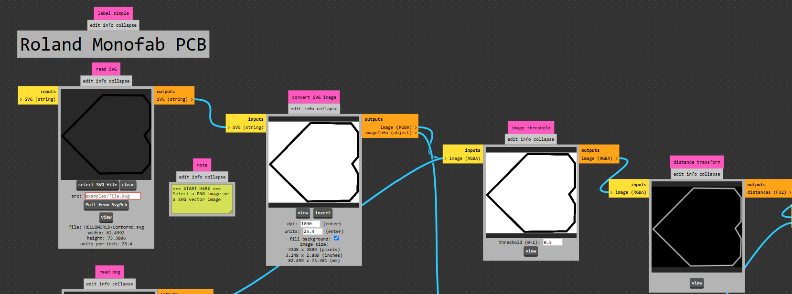 
  Figura 4.1: Vista previa del archivo de contornos en el panel de entrada.

* **Configuración de herramientas:**

  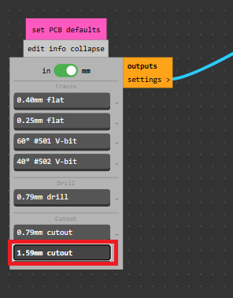 
  Figura 4.2: Ajuste del diámetro de la fresa a 2 mm para el contorno.

  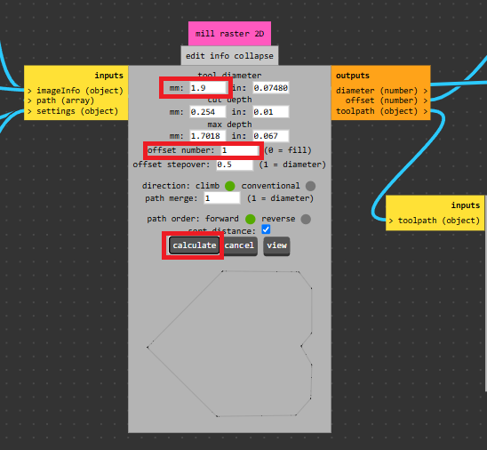 
  Figura 4.3: Configuración avanzada del número de pasadas en la herramienta de corte.

* **Orígenes y velocidad:**

  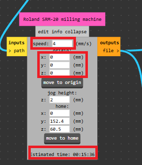 
  Figura 4.4: Establecimiento de coordenadas de origen y velocidad de avance a 4 mm/s.

* **Visualización 3D:**

  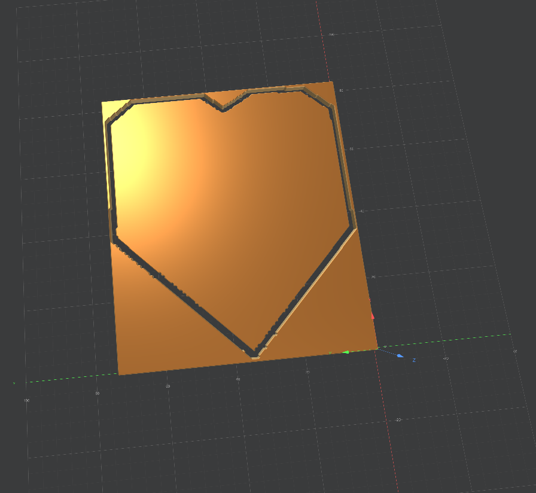 
  Figura 4.5: Inspección en 3D de las trayectorias de corte exterior generadas.

*(Una vez finalizado este archivo, recuerda dar `F5` o recargar la página web de Mods antes de continuar).*

### 4.2. Segunda Etapa: Pistas (Trazado)
Una vez recargada la plataforma, procedemos con el circuito y trazado de las pistas de la placa.
* **Herramienta a utilizar:** Herramienta en V (**V-bit**) de **0.4 mm**.
* **Configuración en Mods:**
  * Cargamos el archivo SVG correspondiente a las pistas del circuito.
  * Configuramos el diámetro de la herramienta en **0.4 mm**.
  * Ajustamos los parámetros de pasadas para garantizar el aislamiento eléctrico correcto entre pistas; aquí recomendamos **2 pasadas**.
  * Mantenemos la velocidad de corte en **4 mm/s**.
  * Verificamos la simulación visual (recordando que lo negro será removido por la punta en V).
  * Generamos y guardamos el archivo `.rml` de pistas.

* **Visualización de nuestro archivo:**

  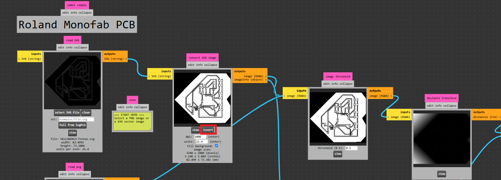 
  Figura 4.6: Carga y previsualización gráfica del circuito de pistas.

* **Configuración de herramientas:**

  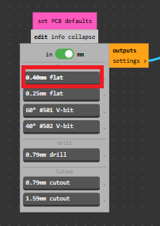 
  Figura 4.7: Configuración de la herramienta en V con diámetro de 0.4 mm.

  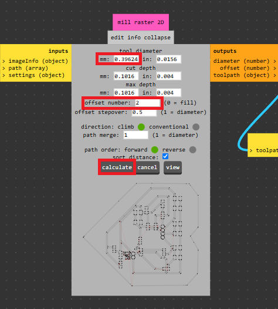 
  Figura 4.8: Ajuste de las 2 pasadas recomendadas para el aislamiento correcto de las pistas.

* **Orígenes y velocidad:**

  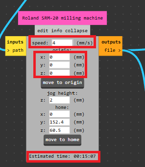 
  Figura 4.9: Configuración de origen y velocidad estándar de 4 mm/s para pistas.

* **Visualización 3D:**

  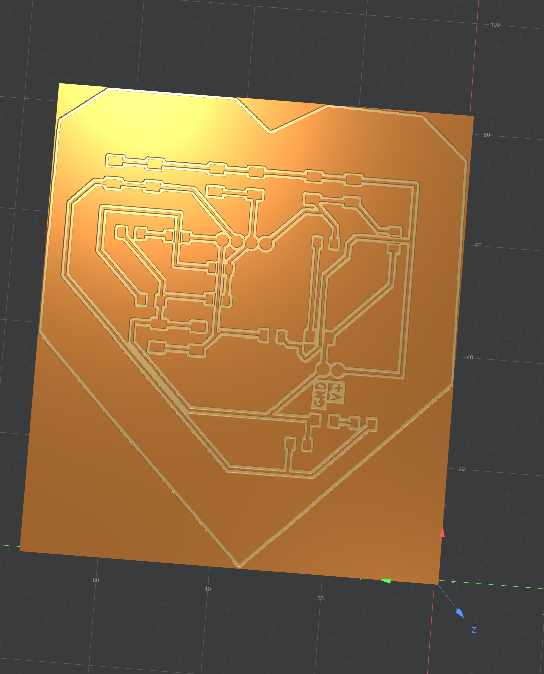 
  Figura 4.10: Simulación tridimensional del aislamiento de pistas de cobre.

*(Nuevamente, al terminar la exportación, damos un nuevo `refresh` a la página de Mods para limpiar la interfaz).*

### 4.3. Tercera Etapa: Perforaciones
Finalmente, procesamos los puntos correspondientes al aislamiento o barrenado para las perforaciones de pines o componentes que lo requieran.
* **Herramienta a utilizar:** Broca de **0.8 mm**.
* **Configuración en Mods:**
  * Cargamos el archivo SVG o de puntos de perforación.
  * Ajustamos el diámetro de la herramienta a **0.8 mm**.
  * **Ajuste crítico de velocidad:** Cambiamos la velocidad de avance a un valor mucho más lento, fijándola entre **0.3 mm/s y 0.4 mm/s**. Esto es fundamental para evitar la tensión excesiva y prevenir la ruptura de la broca debido a su delgadez.
  * Verificamos los tiempos estimados de este proceso, calculamos trayectorias y abrimos la vista 3D para confirmar los puntos de perforación.
  * Guardamos el archivo `.rml` final para enviarlo a la MonoFab.

* **Visualización de nuestro archivo:**

  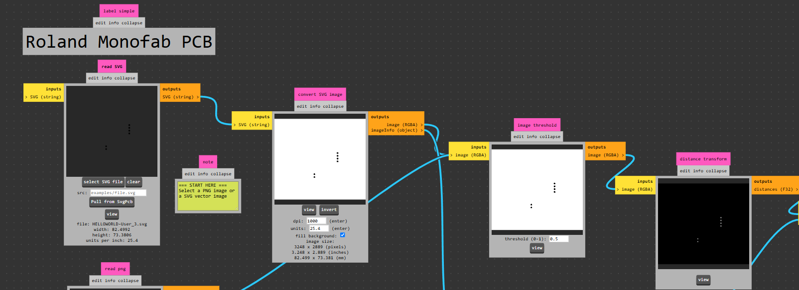 
  Figura 4.11: Carga y previsualización de los puntos de perforación.

* **Configuración de herramientas:**

  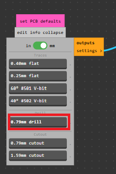 
  Figura 4.12: Establecimiento del diámetro de la broca a 0.8 mm.

  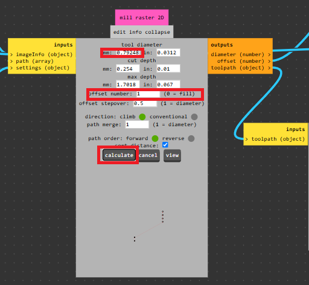 
  Figura 4.13: Configuración fina de profundidad para los puntos de perforación.

* **Orígenes y velocidad:**

  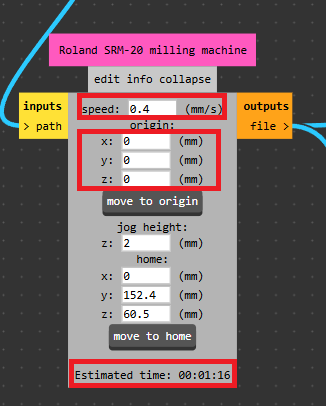 
  Figura 4.14: Ajuste crítico de velocidad reducida (0.3 - 0.4 mm/s) para evitar ruptura de broca.

* **Visualización 3D:**

  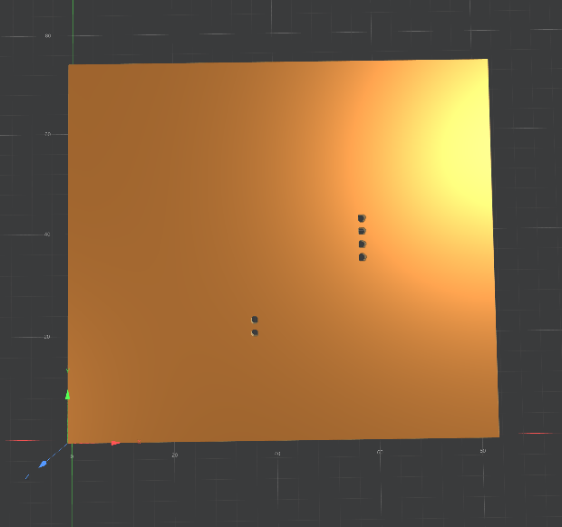 
  Figura 4.15: Inspección en 3D de las trayectorias correspondientes a las perforaciones.

---

## 5. Resumen de Parámetros Clave para el Maquinado

Para tener una referencia rápida antes de operar la máquina, la siguiente tabla resume las herramientas, velocidades y consideraciones por cada proceso:

| Proceso | Herramienta / Diámetro | Velocidad de Avance | Consideraciones Especiales |
| :--- | :--- | :--- | :--- |
| **Contornos** | Fresa de **2 mm** | **4 mm/s** | Revisar que el vector esté dentro del lienzo en Inkscape. |
| **Pistas** | Herramienta en V de **0.4 mm** | **4 mm/s** | Dar *refresh* a la web antes de cargar; usar 2 pasadas para aislar correctamente. |
| **Perforaciones**| Broca de **0.8 mm** | **0.3 - 0.4 mm/s** | Velocidad reducida obligatoria para evitar la ruptura de la broca. |

---
