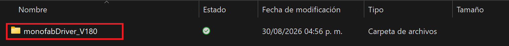
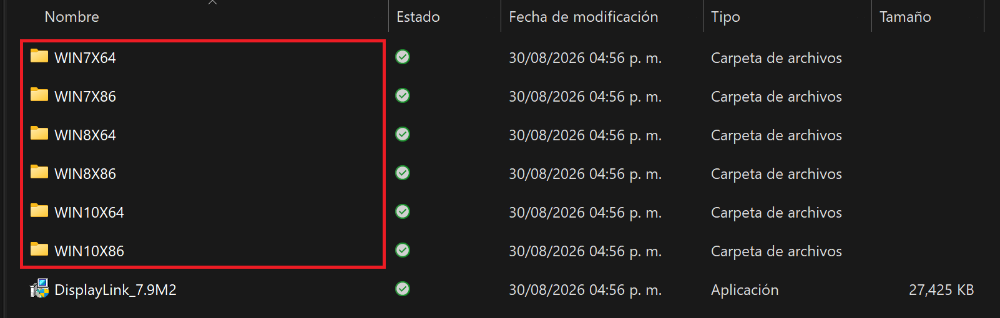
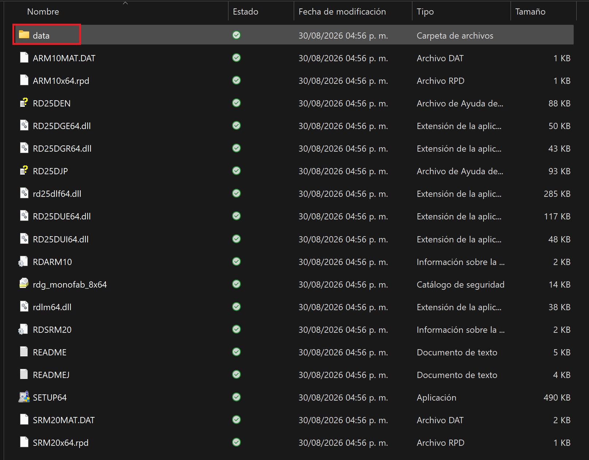
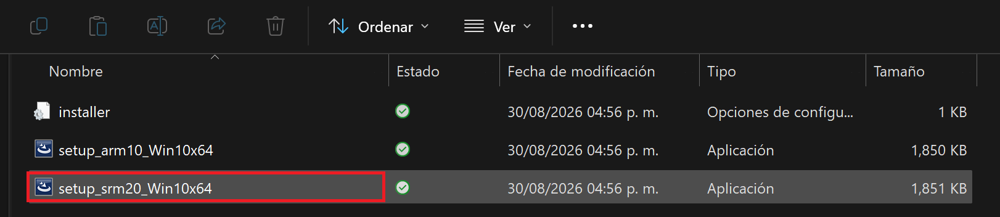
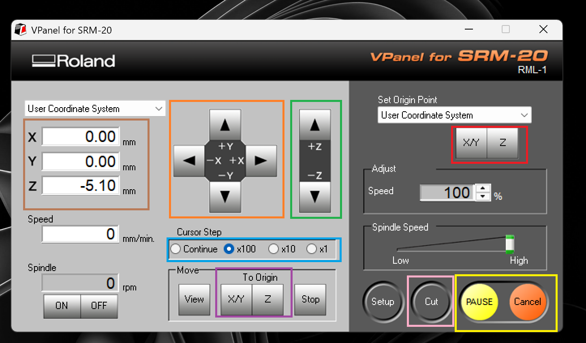
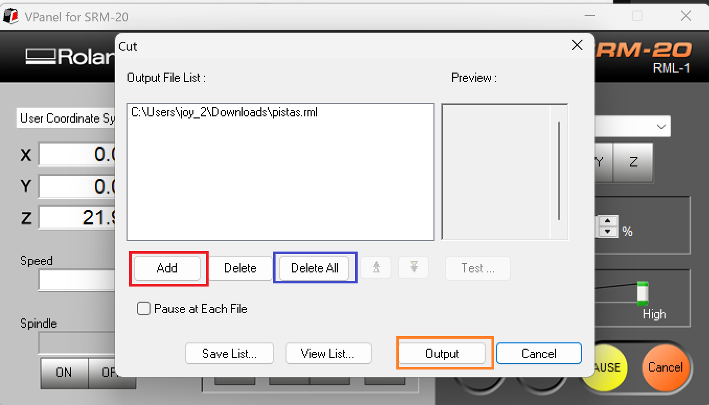

# Guía Completa de Operación y Fabricación con Roland MonoFab SRM-20

A continuación, se presenta la documentación detallada para la correcta instalación, configuración y operación de la fresadora Roland MonoFab SRM-20, diseñada específicamente para el flujo de trabajo en la fabricación de circuitos impresos (PCBs).

---

##  Índice
1. [Drivers Necesarios y VPanel](#1-drivers-necesarios-y-vpanel)
2. [Operación del VPanel y Menú Principal](#2-operación-del-vpanel-y-menú-principal)
3. [Estrategia de Trabajo por Fases y Herramientas](#3-estrategia-de-trabajo-por-fases-y-herramientas)
4. [Camas de Sacrificio y Recursos](#4-camas-de-sacrificio-y-recursos)
5. [Proceso de Fabricación Paso a Paso](#5-proceso-de-fabricación-paso-a-paso)
6. [Evidencia en Video del Funcionamiento](#6-evidencia-en-video-del-funcionamiento)
7. [Recomendaciones de Seguridad y Operación](#7-recomendaciones-de-seguridad-y-operación)
8. [Galería de Placas Fabricadas](#8-galería-de-placas-fabricadas)

---

## 1. Drivers Necesarios y VPanel

Para asegurar la correcta comunicación entre la computadora y la máquina, es indispensable contar con los controladores oficiales y el software de control **VPanel**.

* **Drivers de la máquina:** Puedes realizar la descarga directa desde [este sitio en Teams](https://teams.microsoft.com/l/entity/77be3f72-7c14-415f-992c-3511dd54a4ae/classwork?context=%7B%22channelId%22%3A%2219%3AwwsdzMOPChqnRLhR8ADccnLuQRaGSE3DsepvFw0p5301%40thread.tacv2%22%2C%22contextType%22%3A%22channel%22%2C%22subEntityId%22%3A%22%7B%5C%22action%5C%22%3A%5C%22navigate%5C%22%2C%5C%22view%5C%22%3A%5C%22classwork-list%5C%22%2C%5C%22config%5C%22%3A%7B%5C%22classes%5C%22%3A%5B%7B%5C%22id%5C%22%3A%5C%229e32c9c3-03d2-4226-8efb-b7edfa785ee0%5C%22%2C%5C%22moduleIds%5C%22%3A%5B%5C%22af595126-d997-4016-91b2-a875a1c3fa1e%5C%22%5D%7D%5D%7D%2C%5C%22deeplinkType%5C%22%3A4%7D%22%7D&groupId=9e32c9c3-03d2-4226-8efb-b7edfa785ee0&tenantId=32ddf65d-e60f-490d-b6f4-eceeb29d5fd9&openInMeeting=false&isTeamLevelApp=true){: target="_blank" } o consultar la sección oficial de soporte de Roland para garantizar la compatibilidad con tu sistema operativo. Una vez descargado, sigue los pasos de instalación seleccionando la carpeta correspondiente a tu arquitectura de sistema.

   

   
  Figura 1: Selección de la carpeta según nuestro sistema operativo.

   

   
  Figura 2: Ejecución del driver srm-20 como administrador.

* **Instalación del VPanel:** El VPanel es la interfaz gráfica que nos permite manipular los ejes de la máquina, configurar velocidades de desplazamiento y enviar los archivos de corte (`.rml`). Puedes descargar el programa desde el siguiente enlace: <a href="../recursos/archivos/VPanel-for-SRM-20_Installer.Zip" target="_blank">[VPanel-for-SRM-20_Installer (Zip)]</a>. Una vez descargado, descomprime el archivo y ejecuta el instalador.

---

## 2. Operación del VPanel y Menú Principal

El VPanel cuenta con diferentes secciones clave para el control de movimiento y la gestión de los trabajos de mecanizado.

   
  Figura 3: Menú principal del VPanel para SRM-20.

### Controles de Movimiento y Unidades (Cursor Step)
* 🟠 **Naranja y 🟢 Verde:** En la parte central del VPanel encontramos los botones de desplazamiento manual para los ejes X, Y y Z.
* 🔵 **Azul:** Justo debajo se encuentran los selectores de **Cursor Step** (`Continue`, `x100`, `x10`, `x1`). Entre más pequeño sea el valor seleccionado (como `x1`), menor será el recorrido físico de la herramienta por cada clic. Esto es **extremadamente útil para la calibración fina** y ajustes de alta precisión.

### Orígenes y Sistema de Coordenadas
* 🔴 **Rojo (Guardar Orígenes):** Permite definir y almacenar nuestros puntos de origen (ceros de trabajo en X, Y y Z) utilizando los botones de configuración de coordenadas en el panel lateral derecho.
* 🟡 **Amarillo (Pausa y Cancelar):** Botones de control de ejecución (`PAUSE`/`RESUME` y `Cancel`), vitales para detener el proceso inmediatamente en caso de cualquier emergencia o imprevisto.
* 🟤 **Café:** Muestra las coordenadas actuales de la herramienta.
* 🟣 **Morado:** Mueve los ejes automáticamente hacia el origen previamente guardado.
* ⚪ **Rosa:** Permite iniciar el proceso de carga y envío del archivo de corte.

   
  Figura 4: Vista general del panel con las secciones e indicadores mencionados.

Una vez dado clic en el botón de **Cut**, se desplegará el menú de gestión de archivos. A través de este menú podremos subir nuestro archivo de trabajo (*.rml*). El proceso de fresado iniciará de forma automática en cuanto presionemos **"Output"**. Es **fundamental** haber calibrado correctamente todos nuestros ejes y asegurarnos de que la punta de la herramienta esté despegada de la superficie de la placa antes de iniciar, evitando así rayones o daños prematuros en la punta.

   
  Figura 5: Ventana de carga y envío de archivos de corte.

---

## 3. Estrategia de Trabajo por Fases y Herramientas

Para la fabricación exitosa de una placa de circuito impreso (PCB), es indispensable mantener un orden riguroso y utilizar la herramienta adecuada en cada etapa del proceso:

1. **Perforaciones:** Se inicia perforando los puntos de anclaje y pines de los componentes. Para esta fase utilizaremos una broca especializada de **0.8 mm**.
2. **Trazado de Pistas:** En esta segunda etapa se generan los aislamientos y trazas del circuito. Utilizaremos un cortador en V (*V-cutter*) con un diámetro de **0.4 mm**.
3. **Contorno:** Finalmente, se realiza el corte exterior del perímetro para liberar y separar la placa de la base utilizando una fresa de **2 mm**.

   
  Figura 6: Herramientas de sujeción, espátulas, brocas y la llave Allen indispensable para aflojar y apretar el mandril.

---

## 4. Camas de Sacrificio y Recursos

* **Camas de sacrificio:** Es altamente recomendable utilizar camas de sacrificio dedicadas (fabricadas comúnmente en MDF o materiales similares) colocadas directamente sobre la base de aluminio de la máquina. Esto protege la estructura principal de la fresadora de daños accidentales durante el fresado de contornos profundos.
* **Descarga de Archivos:** Puedes acceder al diseño base y esquemáticos en formato DXF desde el siguiente enlace:  
  <a href="../recursos/archivos/Sacrificio SS.dxf" target="_blank">[Sacrificio SS (DXF)]</a>

---

## 5. Proceso de Fabricación Paso a Paso

1. **Preparación de la Superficie:** Limpiamos exhaustivamente la cama de sacrificio y utilizamos **cinta doble cara** para fijar firmemente nuestra placa de cobre, procurando pegarla de manera uniforme y alineada para prevenir errores de paralelismo.

   
  Figura 7: Aplicación de cinta doble cara en la placa fenólica.

   
  Figura 8: Placa fenólica alineada correctamente sobre la cama de sacrificio.

   
  Figura 9: Ensamblaje completo colocado dentro del área de trabajo de la MonoFab.

2. **Colocación de la Herramienta:** Utilizando la llave Allen, aflojamos cuidadosamente el tornillo de sujeción del mandril, insertamos la broca o cortador correspondiente y volvemos a apretar con firmeza para garantizar su seguridad antes de la calibración.

   
  Figura 10: Inserción y sujeción del cortador en el mandril.

3. **Calibración de Ejes X e Y:** Desplazamos la máquina mediante el VPanel hasta ubicarla exactamente en la esquina inferior izquierda de la placa de cobre y guardamos este punto como el origen en X e Y (`X/Y` en *Set Origin Point*).
4. **Calibración del Eje Z:** Para calibrar la altura de la herramienta, utilizamos el método tradicional de colocar un **pequeño trozo de papel bond** entre la punta de la herramienta y la superficie de la placa. Descendemos lentamente el eje Z con saltos finos (`x1`) hasta percibir una ligera fricción al mover el papel. Una vez alcanzado este punto, fijamos el origen en Z.

   
  Figura 11: Proceso físico de calibración de ejes en la esquina de la placa.

5. **Ejecución del Trabajo:** Con los ceros de trabajo correctamente establecidos, cargamos el archivo correspondiente al proceso (por ejemplo, el de perforaciones en formato `.rml`), revisamos la vista previa y presionamos *Output* para iniciar el mecanizado.
6. **Inspección y Limpieza:** Al concluir la tarea, trasladamos la placa hacia la parte frontal mediante el VPanel para facilitar la aspiración de residuos de viruta y verificar visualmente la calidad del resultado.

   
  Figura 12: Placa fenólica perforada lista para el retiro de residuos.

7. **Precaución Crítica en el Cambio de Herramienta:** Procedemos a cambiar la broca actual por la siguiente herramienta del proceso (por ejemplo, el cortador en V para pistas) y **realizamos una recalibración exclusiva en el eje Z**. Es **absolutamente crítico no modificar ni alterar los ejes X e Y**, ya que cualquier variación en dichos ejes desfasará por completo el circuito y arruinará el trabajo posterior.

---

## 6. Evidencia en Video del Funcionamiento

A continuación se muestran los registros audiovisuales del comportamiento de la fresadora Roland MonoFab SRM-20 en cada una de sus fases operativas:

* **Proceso de Perforaciones:**
  <video controls width="100%">
    <source src="docs/videos/perforaciones.mp4" type="video/mp4">
    Tu navegador no soporta la reproducción de video.
  </video>
  Video 1: Proceso automatizado de perforación de la placa de cobre utilizando la broca de 0.8 mm.

* **Proceso de Trazado de Pistas:**
  <video controls width="100%">
    <source src="docs/videos/pistas.mp4" type="video/mp4">
    Tu navegador no soporta la reproducción de video.
  </video>
  Video 2: Mecanizado y aislamiento de las pistas del circuito con el cortador en V de 0.4 mm.

* **Proceso de Contorno:**
  <video controls width="100%">
    <source src="docs/videos/contorno.mp4" type="video/mp4">
    Tu navegador no soporta la reproducción de video.
  </video>
  Video 3: Corte final de contorno de la placa utilizando la herramienta de 2 mm.

---

## 7. Recomendaciones de Seguridad y Operación

> **Nota de ingeniería:** Se aconseja tener estrictamente en cuenta las siguientes pautas operativas durante el uso del equipo en el laboratorio:
> 
> * **Prevención de suspensión del equipo:** Se recomienda ampliamente mantener un archivo de reproducción activo o un video en segundo plano en la computadora de control para inhibir los modos de suspensión o ahorro de energía automáticos del sistema operativo, evitando así cortes en la comunicación USB que puedan congelar o interrumpir un fresado crítico.
> * **Respaldo de energía (UPS):** Es ideal contar con una fuente de alimentación ininterrumpida o regulador con respaldo de batería para proteger el equipo ante apagones repentinos y evitar daños físicos en el material o la herramienta de corte.
> * **Monitoreo inicial obligatorio:** Es vital **permanecer atentos y supervisar los primeros segundos de cada fase de mecanizado**. Una revisión visual oportuna en el arranque permite reaccionar a tiempo ante cualquier error de origen, mala sujeción o parámetros incorrectos antes de comprometer la integridad de la placa.

---

## 8. Galería de Placas Fabricadas

A continuación se exhibe el resultado final y la validación física de las placas de circuito impreso fabricadas por el equipo:

   
  Figura 13: Vista general de la primera PCB fabricada exitosamente.

   
  Figura 14: Vista general de la segunda PCB fabricada y validada.

