# Guía de Inicio Rápido: Primeros pasos con KiCad

Bienvenido a esta guía básica sobre el uso de **KiCad** para el diseño de circuitos impresos (PCB). Aquí encontrarás los conceptos fundamentales y el flujo de trabajo esencial para pasar de un diagrama esquemático hasta el diseño físico de tu tarjeta, incluyendo la incorporación de librerías externas como la de Fab Lab (`fablib`).

---

## Contenido
- [1. Instalación y comprobación de KiCad](#1-instalación-y-comprobación-de-kicad)
- [2. Instalación y configuración de la librería Fab Lab (fablib)](#2-instalación-y-configuración-de-la-librería-fablib-fablib)
- [3. El Editor de Esquemas (Schematic Editor)](#3-el-editor-de-esquemas-schematic-editor)
- [4. El Editor de Placas (PCB Editor)](#4-el-editor-de-placas-pcb-editor)

---

## 1. Instalación y comprobación de KiCad
Para comenzar con el desarrollo de nuestros circuitos, debemos dirigirnos al sitio oficial de KiCad para descargar e instalar la versión más reciente compatible con nuestro equipo.

> 🔗 [Sitio oficial de descarga de KiCad](https://www.kicad.org/download/)

Una vez dentro de la plataforma de descargas, el proceso se divide en dos etapas principales para asegurar que obtengamos el paquete correcto:

### Selección del Sistema Operativo
En la primera vista del sitio web, se nos presenta un panel interactivo donde debemos elegir la plataforma sobre la cual trabajaremos. KiCad ofrece soporte oficial para los sistemas operativos más populares del mercado, permitiendo seleccionar entre **Windows**, **macOS**, **Linux** e incluso contenedores mediante **Docker** para entornos avanzados de desarrollo o servidores.

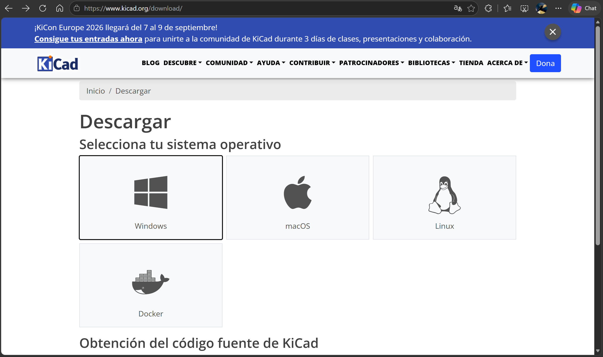

### Selección de Espejos de Descarga (Mirrors) y Regiones
Al hacer clic en nuestro sistema operativo (por ejemplo, Windows), el sitio nos redirige a una sección específica de descargas que muestra la versión estable actual (como la versión 10.0.6 compatible con arquitecturas de 64 bits y ARM). 

En esta sección encontraremos una lista de **espejos de descarga geográficos** divididos por regiones del mundo (como Asia, Australia, Europa y Norteamérica), los cuales son servidores alojados por distintas universidades, fundaciones y empresas aliadas (por ejemplo, CERN, AlibabaCloud, GitHub, entre otros). Esto nos permite elegir el servidor más cercano a nuestra ubicación geográfica para garantizar una descarga rápida, segura y sin interrupciones del instalador oficial.

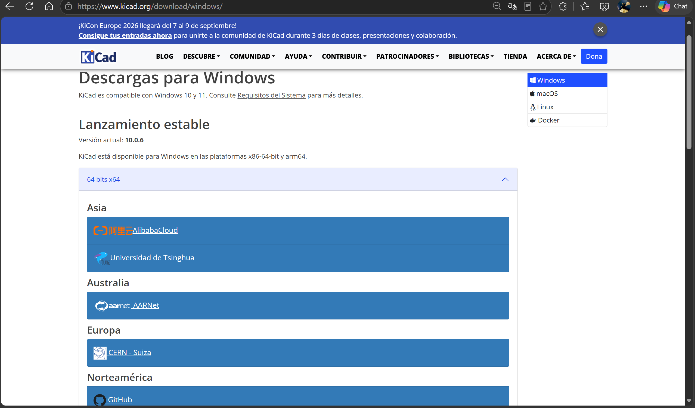
---
### Vista General del Proyecto en KiCad
Esta vista muestra el entorno de trabajo general y el gestor de proyectos de KiCad, donde se vinculan tanto el esquemático como la placa PCB y las librerías externas utilizadas.

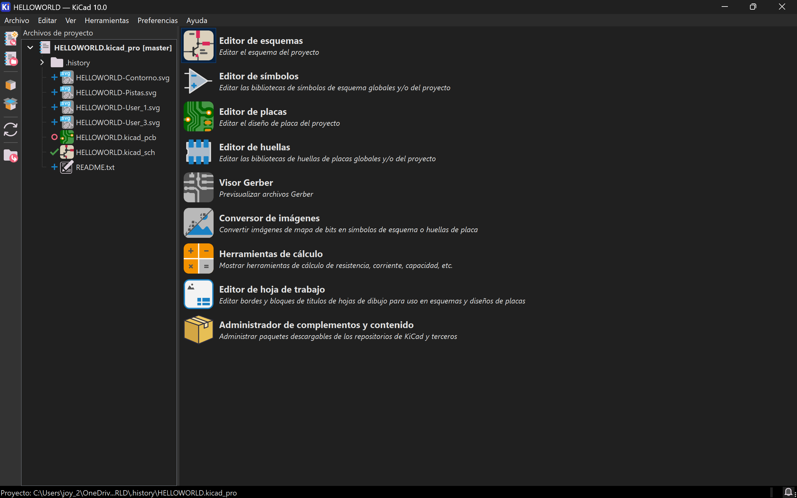

---

## 2. Instalación y configuración de la librería Fab Lab (`fablib`)
Para trabajar con los componentes estándar utilizados en entornos de fabricación digital y laboratorios Fab Lab, es necesario integrar la librería `fablib` en KiCad.

### Pasos para instalar y configurar la librería:
1. Abre KiCad y dirígete al **Administrador de complementos y contenidos**.
2. Desde la pestaña de **Bibliotecas**, busca en la barra de búsqueda `FABLIB`.
3. Una vez encontrada, descárgala y espera a que se complete la instalación.
4. Guarda los cambios para que los componentes queden disponibles en tus proyectos.
5. Finalmente, cierra y vuelve a abrir el programa para asegurar una correcta integración.

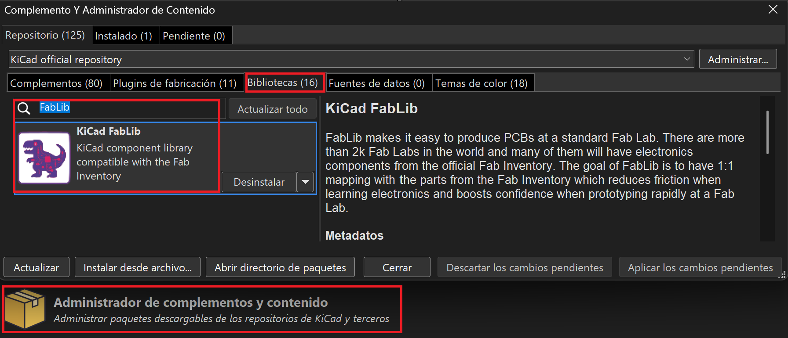

---

## 3. El Editor de Esquemas (Schematic Editor)
El editor de esquemas es el lugar donde defines la lógica de tu circuito electrónico mediante símbolos y conexiones eléctricas, sin preocuparte todavía por la forma física de la placa.

### Vista del Diagrama Esquemático Completo
Aquí se aprecia el circuito lógico completo, mostrando la distribución de los componentes de la librería `fablib`, las conexiones mediante etiquetas (*labels*) y los bloques organizados para mantener un diseño limpio y estructurado.

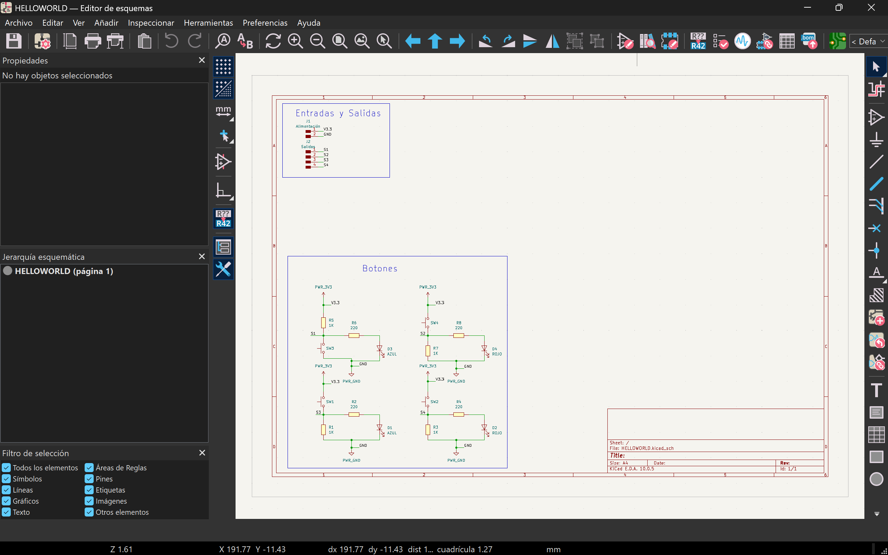

---

### Inserción de componentes
Para añadir un componente al lienzo de trabajo, utiliza la herramienta de inserción o presiona la tecla `A`. Se abrirá una ventana de búsqueda donde podrás buscar componentes genéricos o de la librería `fablib` (como microcontroladores, resistencias, pines, etc.). Haz clic sobre el componente y colócalo en el espacio de trabajo.

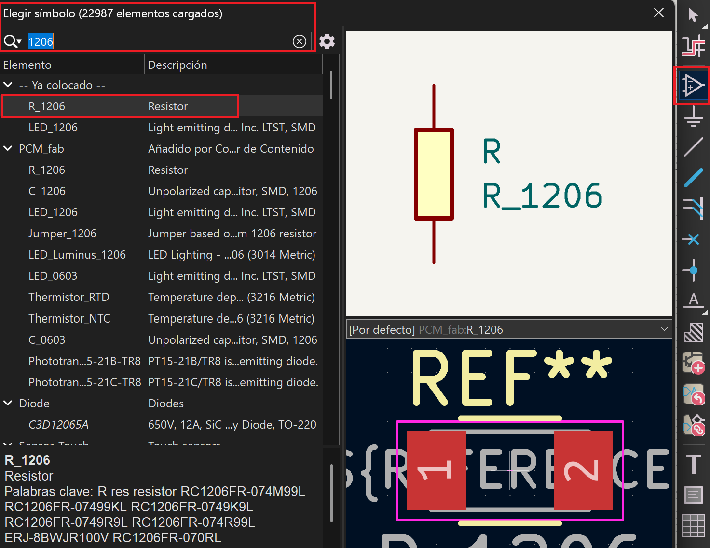

### Uso de etiquetas (Labels) y conexiones
Para conectar componentes distantes sin saturar el diagrama con líneas largas, se utilizan las **etiquetas (Labels)**. Al asignar el mismo nombre de etiqueta a dos nodos diferentes, KiCad entenderá que están conectados eléctricamente.
* Para agregar una etiqueta, presiona la tecla `L` y escribe el nombre deseado.
* Utiliza la herramienta de **cable (`W`)** para realizar conexiones directas entre pines cercanos.
  
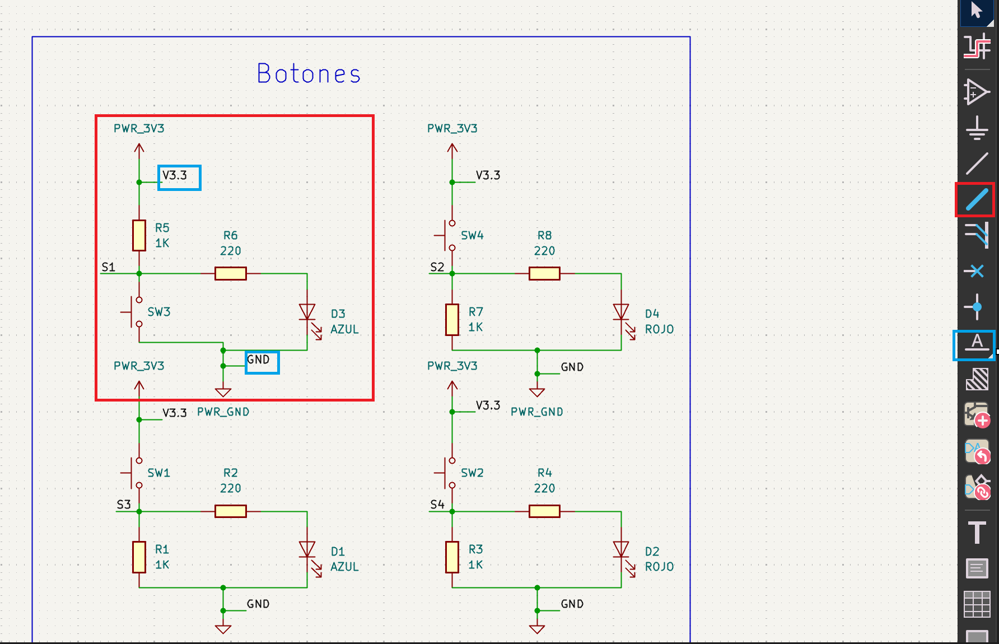

### Herramientas de apoyo visual (Rectángulos y Texto)
Para organizar mejor tu diagrama o documentar secciones importantes, puedes utilizar la herramienta de **Rectángulo** y **Gráfico de Texto**. Estas herramientas se encuentran en la barra lateral derecha y sirven exclusivamente con fines estéticos y de documentación visual, sin alterar las conexiones eléctricas.

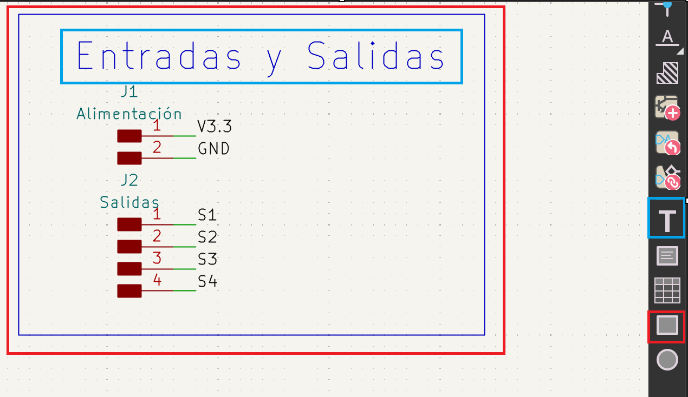

### Detección de errores (ERC - Electrical Rules Check)
Antes de pasar al diseño de la placa, es fundamental comprobar que el circuito no tenga errores lógicos (como pines de alimentación sin conectar o salidas cruzadas). 
* Haz clic en el icono del **chequeo de reglas eléctricas (ERC)** en la barra superior (símbolo de un insecto con una marca de verificación).
* Ejecuta la prueba y revisa la lista de advertencias o errores para corregirlos en el esquemático.

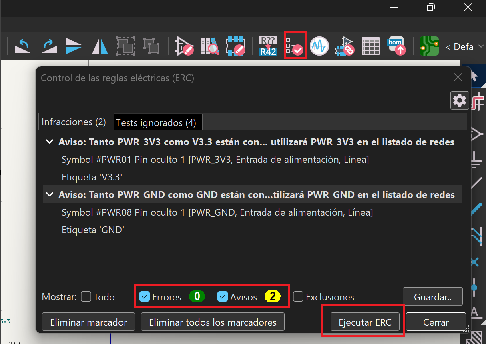

---

## 4. El Editor de Placas (PCB Editor)
Una vez que el esquema está completo y verificado, se procede al diseño físico de la tarjeta en el **PCB Editor**.

### Vista del Editor de Placas (PCB Editor) a Pantalla Completa
En esta sección se visualiza el diseño físico final de la tarjeta de circuito impreso, integrando el ruteo de pistas en la capa frontal (`F.Cu`), el contorno definido en `Edge.Cuts`, las zonas rellenas y la ausencia de errores tras la verificación del DRC.

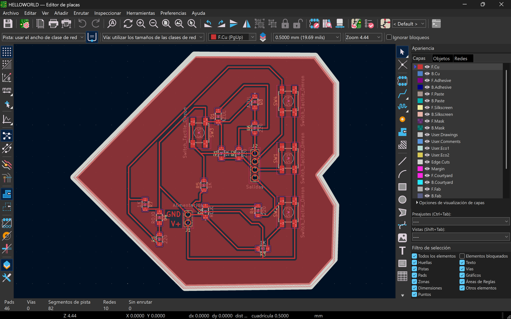

### Sincronización: Actualizar placa desde el esquema
Para transferir los componentes y conexiones lógicas del esquemático al editor de placas, haz clic en el botón **"Actualizar PCB desde el esquema"** (o presiona `F8`). 
* Es muy importante verificar que no existan errores o conflictos; esto indica que todos los componentes utilizados cuentan con su respectivo símbolo y huella.
* Este paso colocará los componentes agrupados, listos para ser posicionados en el área de trabajo. En esta etapa, procura evitar cruzar líneas guía innecesarias, ya que estas marcan las rutas de conexión.

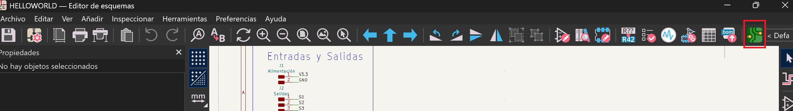

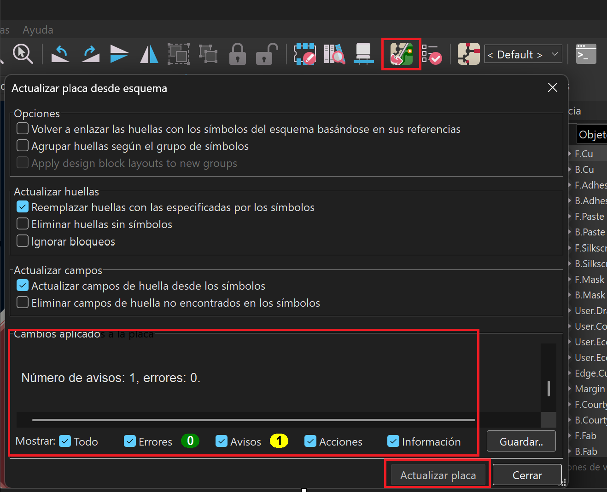

### Capas principales (Layers)
En el editor de placas trabajas con diferentes capas superpuestas. Las más destacadas son:
* **F.Cu (Front Copper):** Capa de cobre frontal (pistas superiores).
* **Edge.Cuts:** Capa de recortes, donde se dibuja el contorno o la silueta física de la tarjeta.

Puedes alternar entre capas utilizando el panel derecho de selección o mediante atajos rápidos.

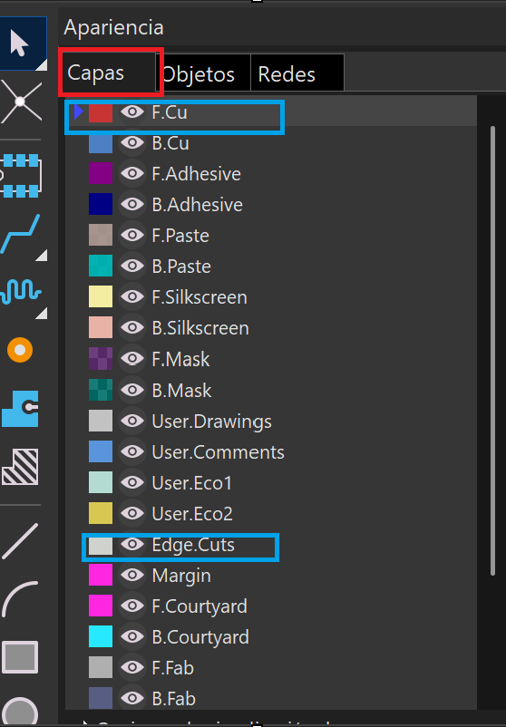

### Personalización predeterminada del ancho de pistas
Puedes configurar previamente los grosores para el trazado de pistas. Como recomendación general, se sugieren **0.4 mm** para las pistas de ruteo y **0.8 mm** para los bordes de corte. 
* Dirígete a la parte superior izquierda, debajo de la barra de tareas, y en el menú desplegable configura los nuevos valores predeterminados.

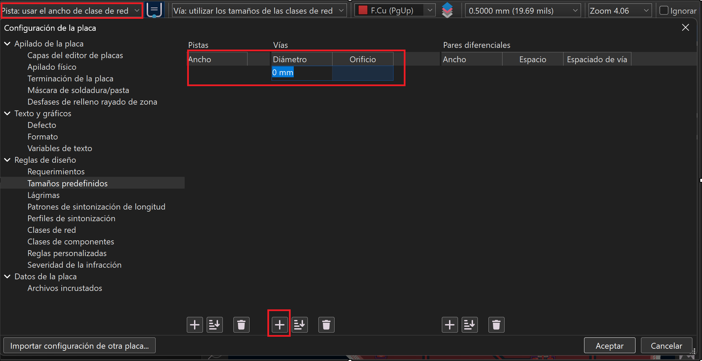

### Rutear pistas (Routing)
El ruteo consiste en trazar las conexiones físicas de cobre entre los pines de los componentes. 
* Selecciona la herramienta **Ruta de pistas** (o presiona la tecla `X`).
* Haz clic en el pin de origen y guía la pista hasta el destino respetando las reglas de diseño y el ancho adecuado. 
* **Recomendaciones:** Evita dejar pistas con ángulos rectos (90°) y trabaja siempre sobre la capa `F.Cu`, ya que ahí quedarán grabadas las pistas sobre el cobre.

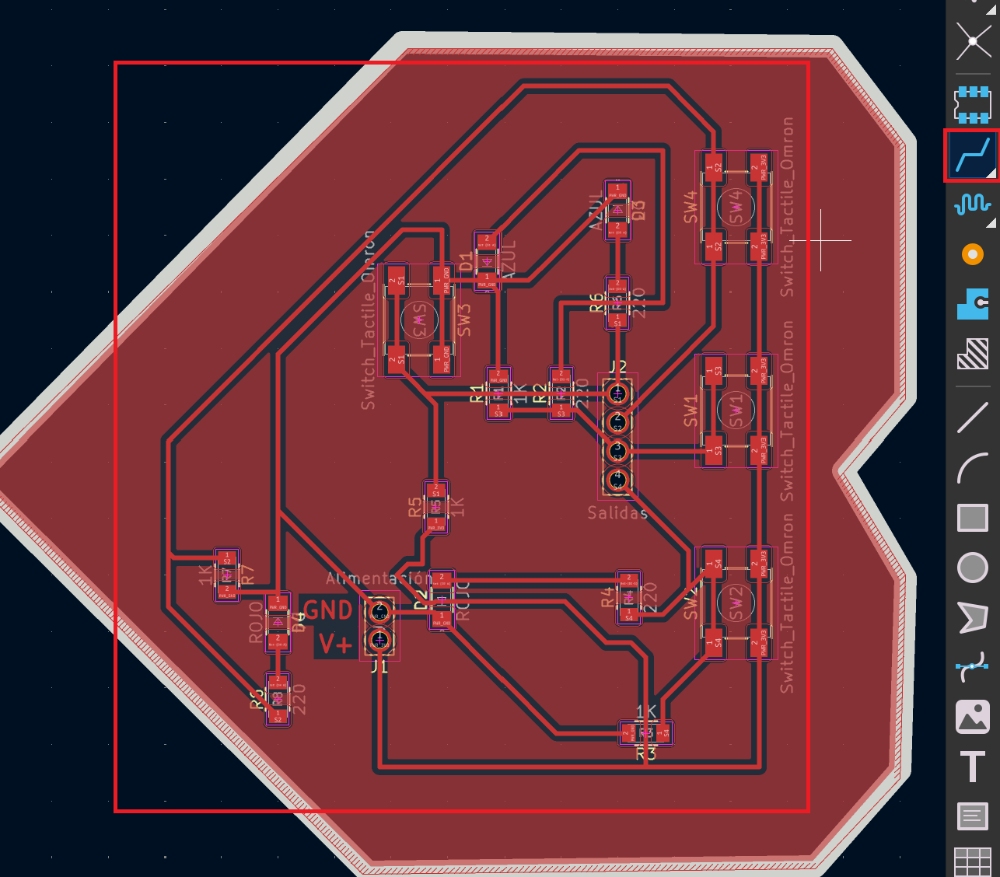

> **¿Qué hacer si no se puede completar una conexión?** Puedes implementar un puente regresando al esquemático para añadir una resistencia con valor `0 ohms`, la cuál servirá como puente físico para pasar por encima de otras pistas. Actualiza la placa tras añadirla para importarla al diseño físico.

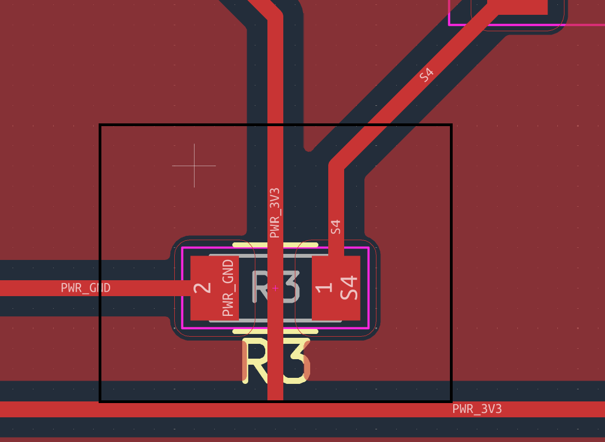

### Adición de texto en la placa
Puedes añadir texto identificativo (nombre, fecha, versión o etiquetas de pistas como `GND` o `V+`) directamente sobre la placa utilizando la herramienta de **Texto** (`T`). Colócalo en capas como `F.Cu` o en una capa de usuario (`User.Drawings`) para que se grave o imprima correctamente en el circuito final.

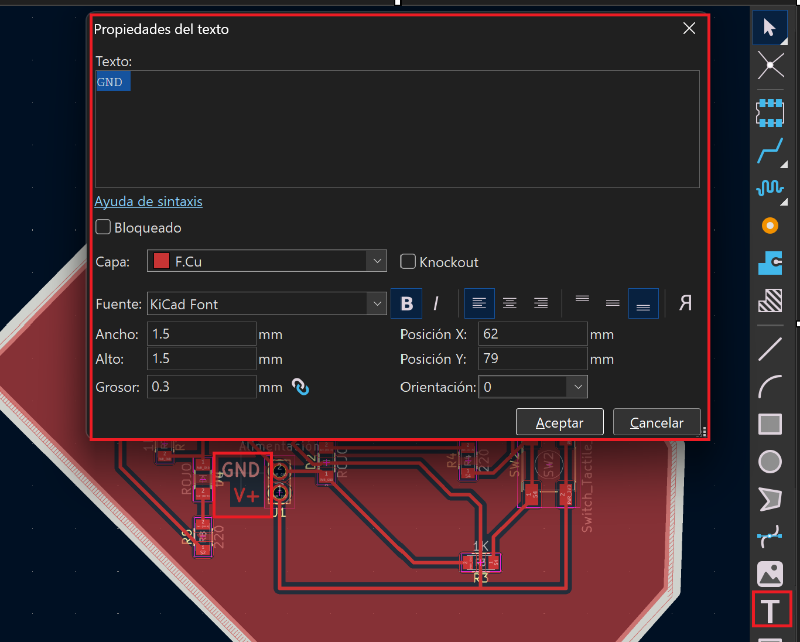

### Perforación de la placa
Cuando los componentes requieran perforaciones adicionales:
1. Emplea una capa de usuario libre (por ejemplo, una capa `User` que no estés utilizando).
2. Dibuja un círculo con la herramienta correspondiente en el sitio exacto y asegúrate de asignarle un relleno sólido.
3. Para ajustar su posición exacta, selecciónalo, presiona la tecla `E` y modifica los valores de las coordenadas `X` e `Y`.
4. Si necesitas múltiples perforaciones idénticas, selecciona el círculo y presiona la combinación `Ctrl + T` para generar una matriz, configurando el origen, la orientación y el número de copias necesarias.

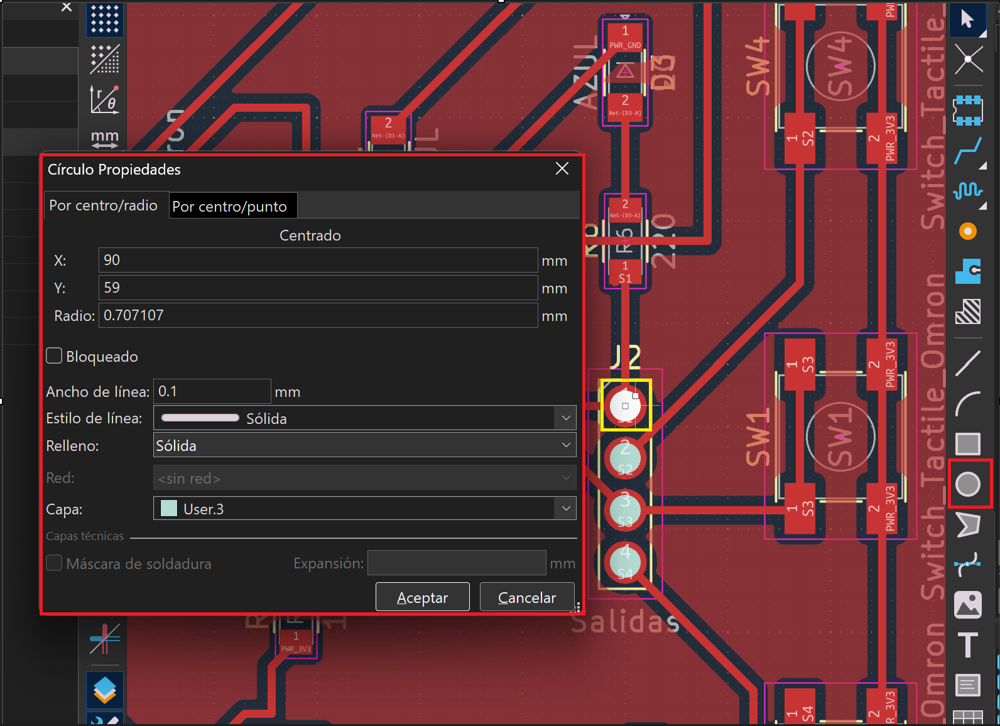

### Dibujar el contorno y polígonos (Filled Zones)
1. Selecciona la capa **Edge.Cuts** y utiliza la herramienta de polígono o rectángulo para trazar el contorno de tu placa.
2. Para crear planos de tierra o alimentación, utiliza la herramienta **Añadir zona llena** (`Ctrl + Shift + Z`). Selecciona la capa correspondiente (por ejemplo, `GND` en `B.Cu` o `F.Cu`) y dibuja el perímetro alrededor de tus componentes para rellenar los espacios vacíos de cobre.

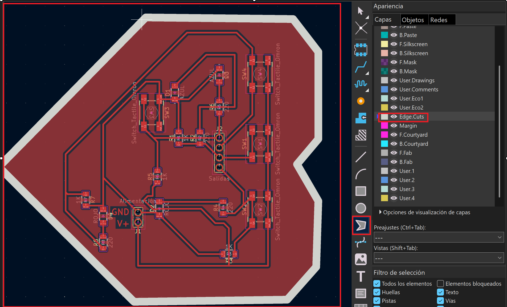

### Añadir zonas rellenas (Filled Zones) con o sin red
La función de **zonas rellenas** (que puedes activar con el atajo `Ctrl + Shift + Z` o desde la barra lateral derecha) permite rellenar áreas vacías de la placa de cobre. Su funcionamiento principal es crear planos continuos de cobre que sirven comúnmente como planos de tierra (`GND`) o de alimentación (`VCC`), ayudando a reducir interferencias electromagnéticas y facilitando el retorno de corriente.

* **Con red asignada:** Al crear la zona, puedes vincularla a una red eléctrica específica (por ejemplo, `GND`). KiCad conectará automáticamente el relleno a todos los pines que pertenezcan a esa misma red, respetando los espacios de aislamiento configurados.
* **Sin red (Libre / Aislada):** Si decides no asignarle ninguna red, la zona funcionará como un plano flotante o estético, útil en algunos procesos de fresado para vaciar el exceso de cobre no deseado alrededor de las pistas sin conectarlo eléctricamente a ningún nodo.
* Es importante asegurarnos de que el primer punto coincida con el último para evitar errores y una vez dibujada la zona y terminada de configurar, debemos presionar la tecla `B` para poder notar los cambios.

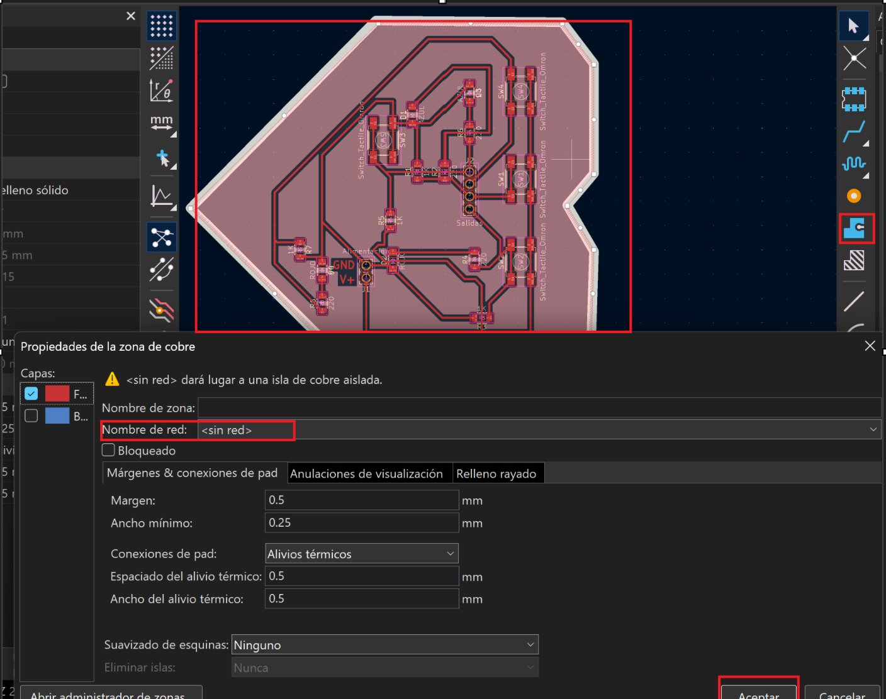

---

### Configuración de reglas de diseño para el DRC (Design Rules Check)
Antes de ejecutar el verificador de reglas, es fundamental configurar los parámetros físicos y de clearances (distancias de aislamiento) que tu método de fabricación soporta (ya sea fresadora CNC o plancha). 

Para modificar estas reglas y los tamaños predeterminados de pistas, debes dirigirte a la barra de menú superior y abrir la configuración de reglas de diseño:
1. Ve a la barra que se encuentra debajo de la barra de herramientas (la que usamos para modificar el ancho de pista).
2. Posteriormente dentro de ese menú dirígete al apartado **Requerimientos**.
3. Aquí podrás modificar los márgenes o anchos mínimos de pistas (*Track width*), el tamaño de las vías (*Vias*) y las holguras mínimas (*Clearance*), asegurándote de que los valores coincidan con las capacidades técnicas de tu área de trabajo o laboratorio antes de correr el DRC.

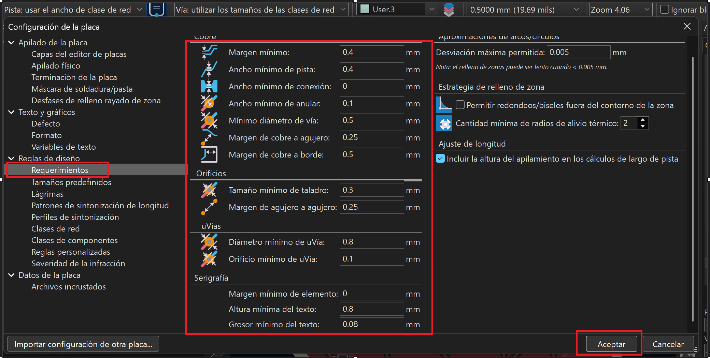

### Detector de errores (DRC - Design Rules Check)
El paso final antes de exportar para fresar o fabricar la tarjeta es verificar que el diseño cumpla con los parámetros físicos (distancias mínimas, anchos y ausencia de cortos circuitos).
* Abre el **Verificador de Reglas de Diseño (DRC)** desde la barra superior.
* Ejecuta la comprobación y asegúrate de solucionar cualquier advertencia o error reportado.

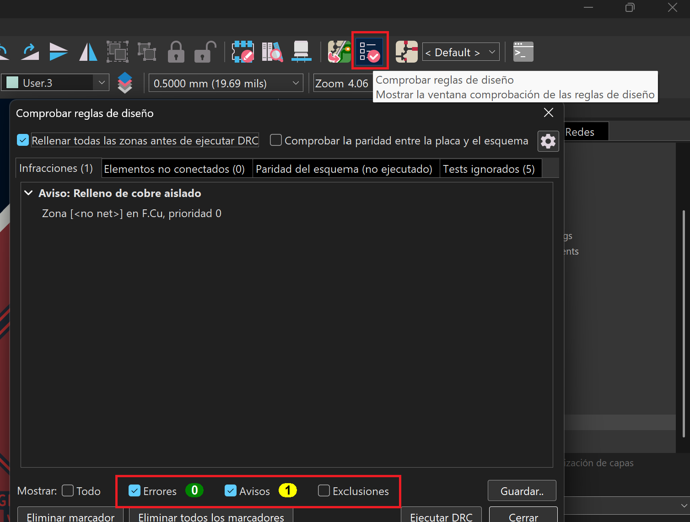

### Exportación de archivos
Una vez comprobado que el diseño está libre de errores de geometría o conexiones:
1. Dirígete al menú **Archivo > Salidas de fabricación > Gerbers** (o selecciona trazados vectoriales).
2. Selecciona el formato de salida (por ejemplo, **SVG** para procesos de corte y grabado digital).
3. Marca únicamente las capas donde añadiste pistas, etiquetas, perforaciones y contornos de corte.
4. Asegúrate de marcar la opción de ajustar la página a la placa y procede a trazar. Los archivos se guardarán directamente en la carpeta de tu proyecto listos para manufactura.

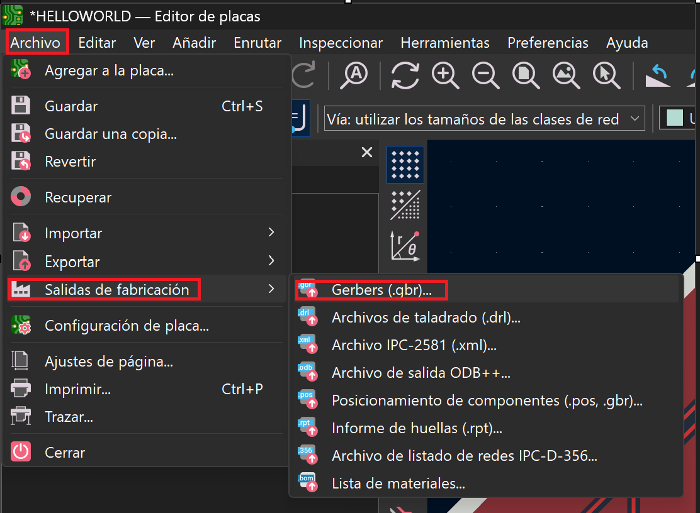

