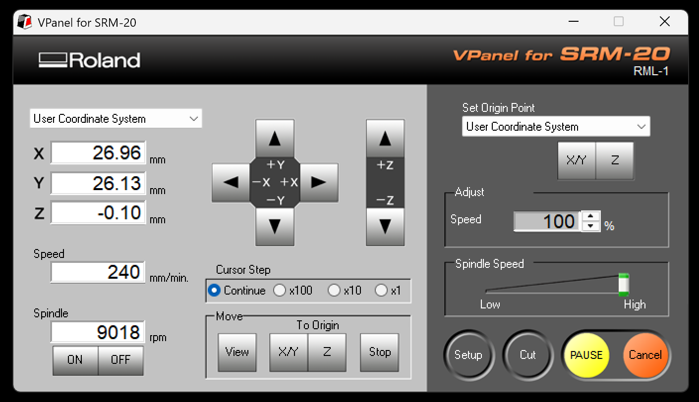
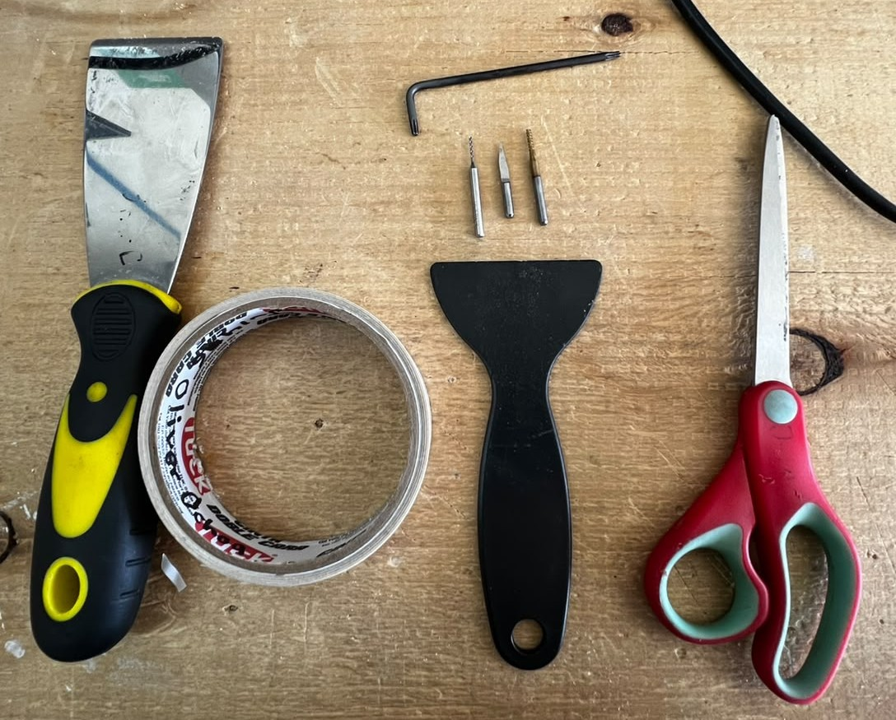
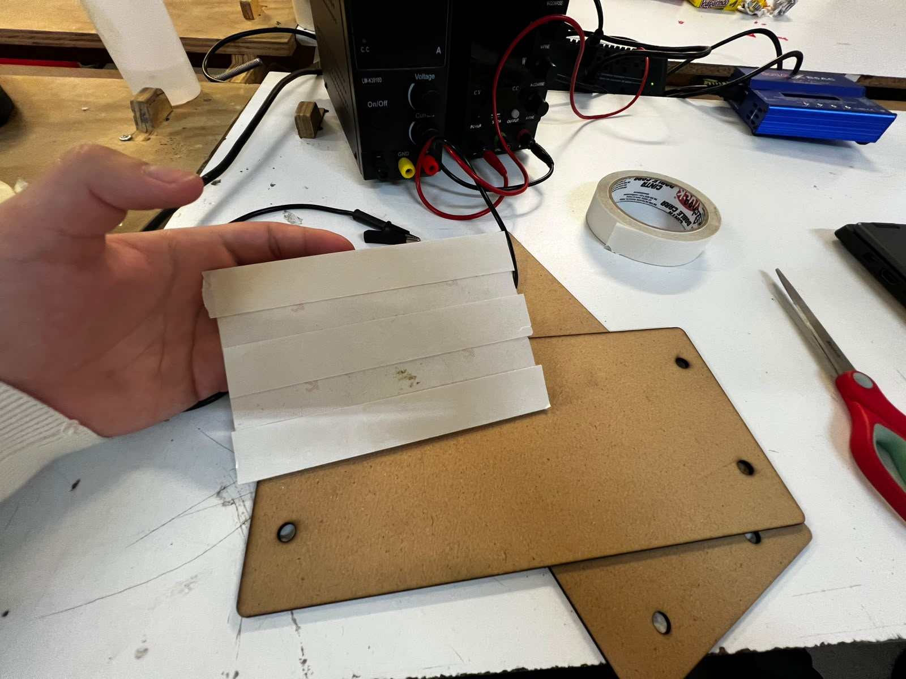
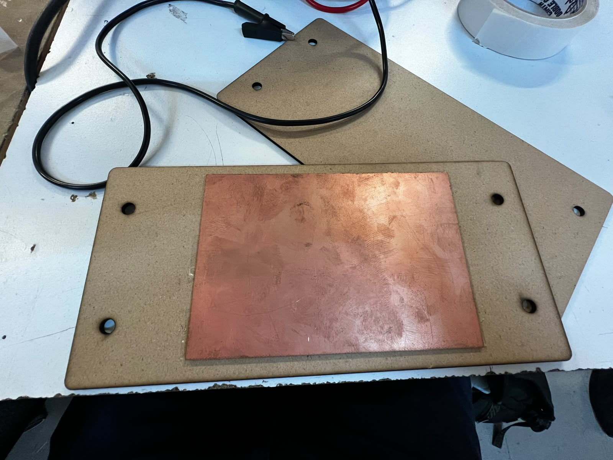
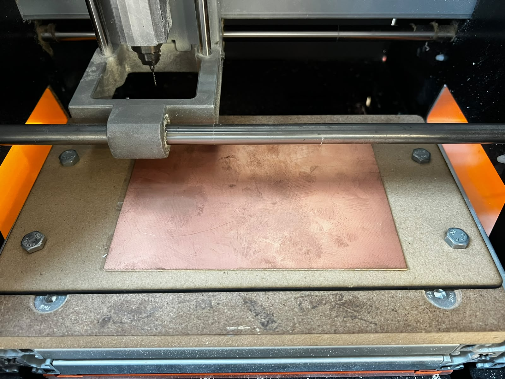
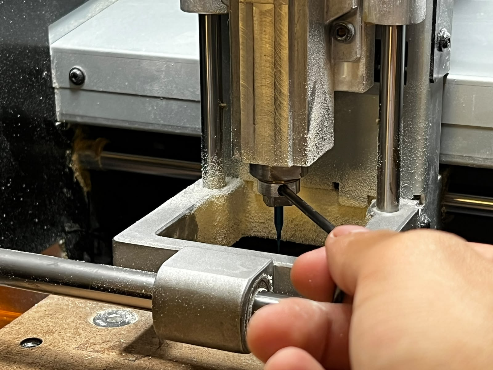
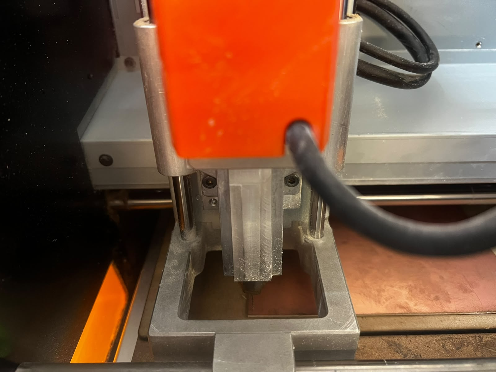
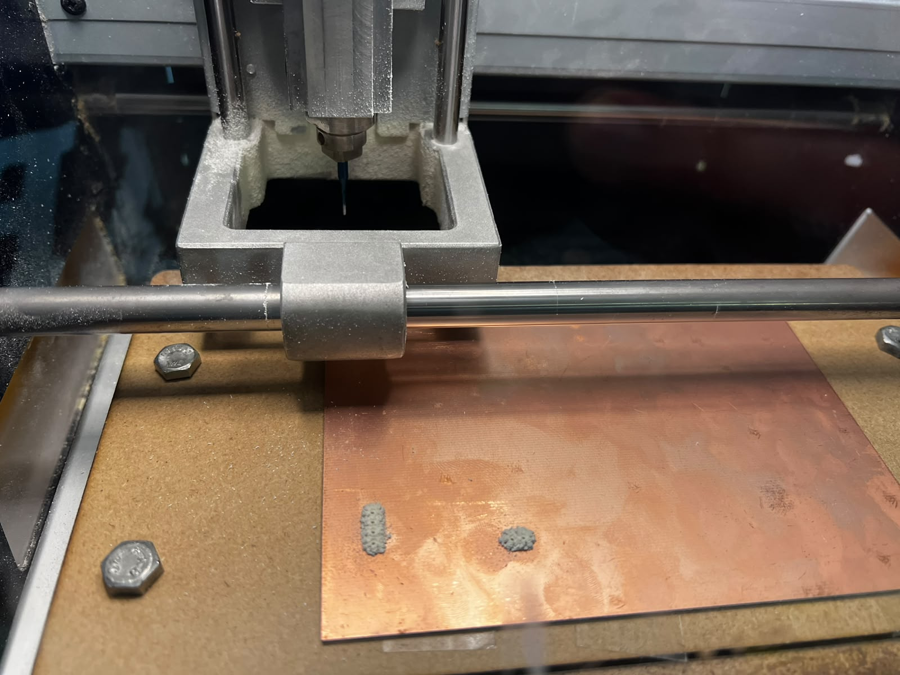
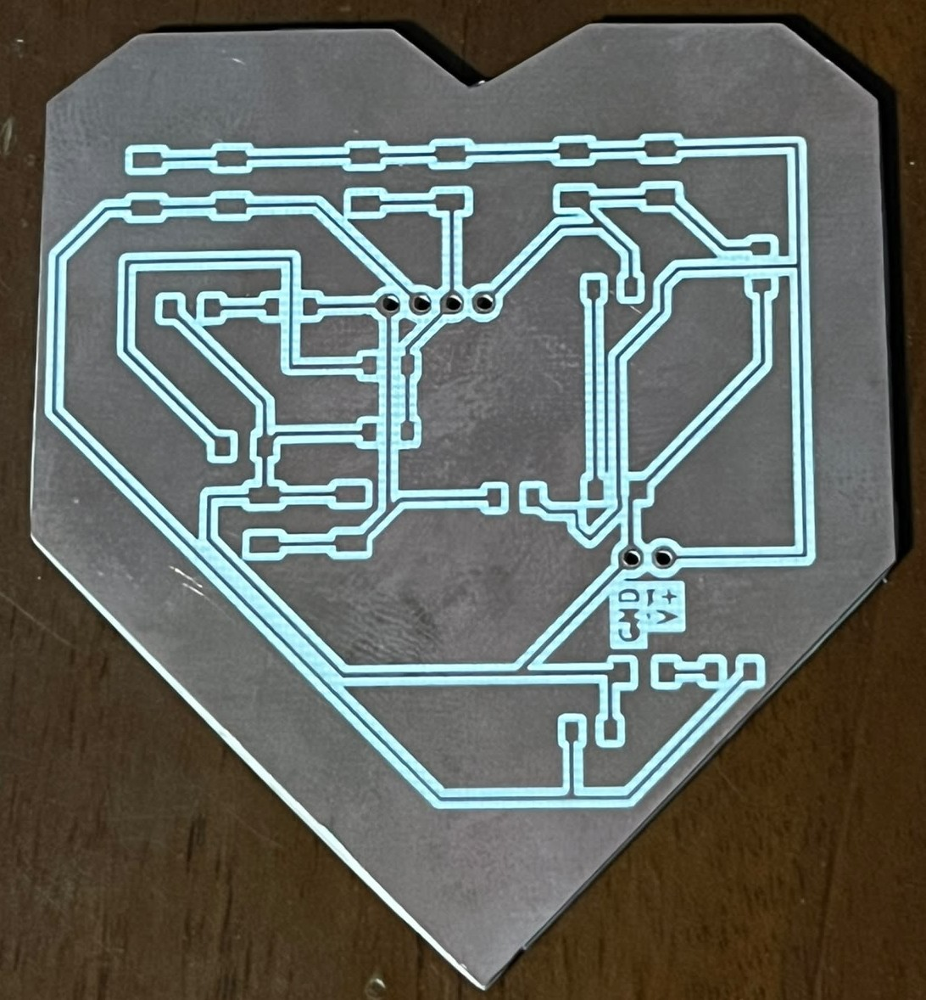
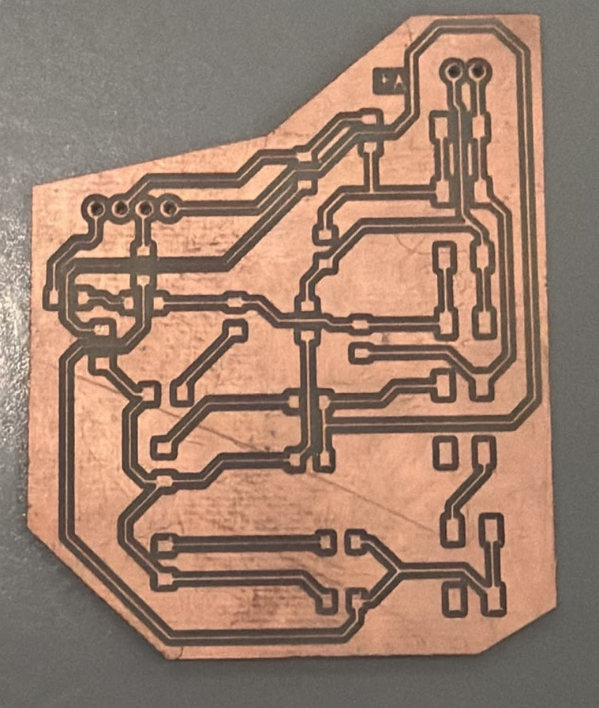

# Guía Completa de Operación y Fabricación con Roland MonoFab SRM-20

A continuación, se presenta la documentación detallada para la correcta instalación, configuración y operación de la fresadora Roland MonoFab SRM-20, diseñada específicamente para el flujo de trabajo en la fabricación de circuitos impresos (PCBs).

---

## Índice
1. [Drivers Necesarios y VPanel](#1-drivers-necesarios-y-vpanel)
2. [Operación del VPanel y Menú Principal](#2-operación-del-vpanel-y-menú-principal)
3. [Estrategia de Trabajo por Fases y Herramientas](#3-estrategia-de-trabajo-por-fases-y-herramientas)
4. [Camas de Sacrificio y Recursos](#4-camas-de-sacrificio-y-recursos)
5. [Proceso de Fabricación Paso a Paso](#5-proceso-de-fabricación-paso-a-paso)
6. [Evidencia en Video del Funcionamiento](#6-evidencia-en-video-del-funcionamiento)
7. [Recomendaciones de Seguridad y Operación](#7-recomendaciones-de-seguridad-y-operación)
8. [Galería de Placas Fabricadas](#8-galería-de-placas-fabricadas)

---

## 1. Drivers Necesarios y VPanel

Para asegurar la correcta comunicación entre la computadora y la máquina, es indispensable contar con los controladores oficiales y el software de control **VPanel**.

* **Drivers de la máquina:** Puedes realizar la descarga directa desde este repositorio en un archivo `.zip` o consultar la sección oficial de soporte de Roland para asegurar la compatibilidad con tu sistema operativo. Una vez descargado, sigue los pasos de instalación seleccionando la carpeta correcta para tu arquitectura:

  <a href="../recursos/archivos/monofabDriver_V180.zip" target="_blank">[monofabDriver_V180 (Zip)]</a>

   

   
  Figura: Selección de la carpeta según nuestro sistema operativo.

   

   
  Figura: Ejecución del driver srm-20 como administrador.

* **Instalación del VPanel:** El VPanel es la interfaz gráfica que nos permite manipular los ejes de la máquina, configurar velocidades y enviar los archivos de corte (`.rml`). Puedes descargar el programa desde el siguiente enlace; una vez descargado, descomprímelo y ejecuta el archivo:

  <a href="../recursos/archivos/VPanel-for-SRM-20_Installer.zip" target="_blank">[VPanel-for-SRM-20_Installer (Zip)]</a>

---

## 2. Operación del VPanel y Menú Principal

El VPanel cuenta con diferentes secciones clave para el control de movimiento y la gestión de trabajos.

   
  Figura: Menú principal del VPanel para SRM-20, mostrando las coordenadas, controles de movimiento, pasos del cursor y botones de operación.

### Controles de Movimiento y Unidades (Cursor Step)
* 🟠 **Naranja y 🟢 Verde:** En la parte central del VPanel encontramos los botones de desplazamiento de los ejes X, Y y Z.
* 🔵 **Azul:** Justo debajo se encuentran los selectores de **Cursor Step** (`Continue`, `x100`, `x10`, `x1`). Entre más pequeño sea el valor seleccionado (como `x1`), menor será el recorrido de la herramienta por cada clic. Esto es **extremadamente útil para la calibración fina** y ajustes de precisión.

### Orígenes y Sistema de Coordenadas
* 🔴 **Rojo (Guardar Orígenes):** Podemos definir y almacenar nuestros puntos de origen (ceros de trabajo en X, Y y Z) utilizando los botones de configuración de coordenadas en el panel lateral derecho.
* 🟡 **Amarillo (Pausa y Cancelar):** En la esquina inferior derecha se encuentran los botones de control de ejecución (`PAUSE`/`RESUME` y `Cancel`), vitales para detener el proceso en caso de cualquier emergencia o imprevisto.
* 🟤 **Café:** Muestra las coordenadas actuales.
* 🟣 **Morado:** Mueve hacia nuestro origen guardado.
* ⚪ **Rosa:** Comenzar un proceso de corte.

   
  Figura: Vista del panel con las secciones mencionadas.

Una vez dado clic en el botón de **`Cut`** se nos desplegará el siguiente menú donde podremos subir un archivo. El fresado comenzará instantáneamente una vez que demos clic en **`Output`**. Es **muy importante** antes de empezar haber calibrado correctamente todos nuestros ejes y tener despegada la broca de nuestra placa para evitar rayones o desgastar la punta.

   
  Figura: Vista del panel para subir archivos.

---

## 3. Estrategia de Trabajo por Fases y Herramientas

Para la fabricación exitosa de una placa de circuito impreso (PCB), es fundamental mantener un orden riguroso y utilizar la herramienta adecuada en cada etapa:

1. **Perforaciones:** Se inicia con las perforaciones de la placa. Para esta fase utilizaremos una broca especial de **0.8 mm**.
2. **Trazado de Pistas:** En esta segunda etapa se generan las trazas del circuito. Utilizaremos un cortador en V (*V-cutter*) con un diámetro de **0.4 mm**.
3. **Contorno:** Finalmente, se realiza el corte exterior para separar la placa utilizando una herramienta de fresado de **2 mm**.

   
  Figura: Herramientas de sujeción, espátulas, brocas y la llave Allen indispensable para aflojar y apretar el mandril que sostiene las herramientas de corte.

---

## 4. Camas de Sacrificio y Recursos

* **Camas de sacrificio:** Es altamente recomendable utilizar nuestras propias camas de sacrificio (usualmente hechas de MDF o materiales similares) colocadas sobre la base de la máquina. Esto protege la estructura principal de la fresadora de posibles daños accidentales durante el fresado de contornos.
* **Descarga de Archivos:** Puedes acceder al diseño base en formato DXF desde el siguiente enlace:  
  <a href="../recursos/archivos/Sacrificio-SS.dxf" target="_blank">[Sacrificio SS (DXF)]</a>

---

## 5. Proceso de Fabricación Paso a Paso

1. **Preparación de la Superficie:** Limpiamos la cama de sacrificio y utilizamos **cinta doble cara** para fijar nuestra placa de cobre, procurando pegarla lo más derecha y alineada posible para evitar errores de paralelismo.

   
  Figura: Placa fenólica con cinta doble cara.

   
  Figura: Placa fenólica alineada correctamente en la cama de sacrificio.

   
  Figura: Placa con cama de sacrificio colocada dentro de la MonoFab.

2. **Colocación de la Broca:** Usando la herramienta de la llave Allen, aflojamos el tornillo y colocamos la broca o cortador; posteriormente volvemos a apretar para continuar con la calibración.

   
  Figura: Colocación del cortador.

3. **Calibración de Ejes X e Y:** Movemos la máquina mediante el VPanel hasta la esquina inferior izquierda de la placa de cobre y guardamos el origen en X e Y (`X/Y` en *Set Origin Point*).
4. **Calibración del Eje Z:** Para el eje Z, utilizamos la técnica clásica de colocar un **pequeño trozo de papel** entre la punta de la herramienta y la superficie de la placa, bajando lentamente el eje Z hasta sentir una ligera fricción al mover el papel. Una vez logrado, fijamos el origen en Z.

   
  Figura: Calibración de la MonoFab en la esquina inferior izquierda.

5. **Ejecución del Trabajo:** Con los orígenes correctamente fijados, subimos nuestro archivo de perforaciones (`.rml`), verificamos la vista previa y presionamos *Output* para iniciar el proceso.
6. **Inspección y Cambio de Herramienta:** Una vez finalizado el trabajo de perforación, acercamos la placa hacia nosotros utilizando el VPanel para poder aspirar los residuos y revisar el resultado.

   
  Figura: Placa fenólica perforada lista para aspirar residuos.

7. **Precaución Crítica en el Cambio de Herramienta:** Procedemos a cambiar la broca por la siguiente herramienta (por ejemplo, el cortador en V para pistas) y **volvemos a calibrar únicamente en el eje Z**. Es **sumamente importante no mover los ejes X y Y**, ya que cualquier alteración en dichos ejes provocará que las pistas o perforaciones posteriores queden totalmente desfasadas.

---

## 6. Evidencia en Video del Funcionamiento

A continuación se muestran los registros en video del comportamiento de la Roland MonoFab SRM-20 en cada una de sus fases operativas:

* **Proceso de Perforaciones:**
  <video controls width="100%">
    <source src="../recursos/imgs/perforaciones.mp4" type="video/mp4">
    Tu navegador no soporta la reproducción de video.
  </video>
  Proceso automatizado de perforación de la placa de cobre utilizando la broca de 0.8 mm.

* **Proceso de Trazado de Pistas:**
  <video controls width="100%">
    <source src="../recursos/imgs/pistas.mp4" type="video/mp4">
    Tu navegador no soporta la reproducción de video.
  </video>
  Mecanizado y aislamiento de las pistas del circuito con el cortador en V de 0.4 mm.

* **Proceso de Contorno:**
  <video controls width="100%">
    <source src="../recursos/imgs/contorno.mp4" type="video/mp4">
    Tu navegador no soporta la reproducción de video.
  </video>
  Corte final de contorno de la placa utilizando la herramienta de 2 mm.

---

## 7. Recomendaciones de Seguridad y Operación

> **Nota de ingeniería:** Se recomienda tener en cuenta las siguientes pautas operativas durante el uso del equipo:
> 
> * **Prevención de suspensión de energía:** Se recomienda que durante cualquier proceso de trabajo se mantenga reproduciendo un video en segundo plano o activo en el equipo de cómputo para evitar que la computadora entre en modo de suspensión o ahorro de energía, lo cual podría interrumpir o apagar la comunicación con el equipo durante un corte o grabado crítico.
> * **Respaldo energético:** Se recomienda contar con una fuente de alimentación ininterrumpida (UPS / pila) o un contacto cercano de respaldo para mantener energizado el equipo y evitar cortes abruptos por fallas en la red eléctrica.
> * **Monitoreo inicial:** Es vital mantenernos al pendiente en los primeros segundos de cada proceso de mecanizado; una supervisión oportuna en el arranque nos permite reaccionar a tiempo para evitar colisiones, corregir errores de configuración de origen o ajustar parámetros de fabricación antes de dañar el material.

---

## 8. Galería de Placas Fabricadas

A continuación se muestra el resultado final del trabajo realizado por el equipo:

   
  Vista general de la primera PCB fabricada.

   
  Vista general de la segunda PCB fabricada.

